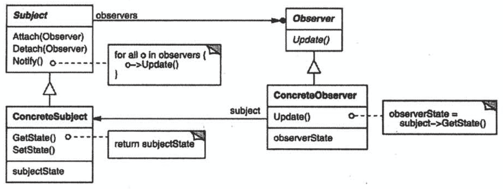

- [歷史考題](https://docs.google.com/spreadsheets/d/14WZJIxLOtizNMCUP21ngRdEdOvj4W7DUexRt3ZGLgBw/edit#gid=0)
- [C# youtube ](https://www.youtube.com/@tutorialsEUC)
- [JAVA 技術網站](https://pdai.tech/) :主要是Java相關技術, 比較全面
- [CS 面試題網站](https://www.mianshi.online/1283.html) :可參考JS, CSS, HTML, 網絡的題目
- [CS 技術網站](https://learn.lianglianglee.com/)

# 待學習
2.  nginx,apache  
4. 網絡, IPS, IDS, 下一代防火牆
10. SNMP来进行路由器交换机的监控
11. CSS,JS,vue,SQL, 項目管理
12. node, 包管理


# 考試範圍

## 普遍範圍
14.9 資訊項目設計、規劃及管理；

14.10 系統分析及開發的專業知識；

14.11 MS SQL Server數據庫設計、管理、開發、結構化查詢語言（SQL）的專業知識；

14.12 應用軟件及網頁程式的設計及開發，包括：Java、Spring Boot、Python、PHP、HTML5、CSS、JavaScript、JSON、XML、Web Service、OpenAPI、RESTful API以及Shell scripts的專業知識；

14.13 雲計算和大數據技術；

14.14 軟件系統的測試方式（包括：單元、功能、集成和壓力測試等）的專業知識；

14.15 智能手機應用程式設計及開發基本知識，包括iOS及Android系統。

16.6 運維開發（DevOps）、持續集成（Continuous Integration）（CI）和持續交付（Continuous Delivery）（CD）的專業知識；

##  統計局
15.13 伺服器系統（例如：Windows Server、Linux、MS SQL Server、Oracle、VMWare、AD Server、DNS Server及FTP等）的架設、規劃、效能調校及權限管理；

15.14 數據中心和網絡系統構建及管理的專業知識，包括：交換機、路由器、防火牆等網絡硬件設備的規劃、效能調校、資訊保安及風險管理等；

15.17 資訊安全及危機管理；

15.18 電腦結構及硬件的專業知識；


## SAFP
14.4 特區政府電子政務發展策略與構建的方案；

14.5 運用資訊科技優化及推動政策實施的方案；

14.6 資訊應用開發範疇的專案管理知識。

## 懲教 軟件

版本控制（Version Control）以及軟件包管理（Software Package Management）的專業知識；

## 法務局 資訊安全
16.9 網絡及硬件管理的專業知識，包括網絡系統及相關設備的規劃、設計、管理及維護；

16.10 伺服器系統的設計、配置、管理、維護及安全相關知識，包括Microsoft Windows Server、Linux、VMware、Nginx及Apache Tomcat；

16.3 資訊安全管理體系及危機管理的專業知識；

16.4 網絡安全、資訊系統安全加固的專業知識，包括CIS Benchmarks、Microsoft MBSA；

16.5 網絡安全設備及資訊安全系統的專業知識；

16.6 雲計算技術概念、雲平台架構的設計、建設、運營及運維的專業知識；

16.7 虛擬化及容器（Container）技術的專業知識；

16.8 數據中心的構建及管理的專業知識；


## 懲教 網絡
5.4. 數據中心和網絡系統構建及管理的專業知識，包括：網絡系統及資訊設備的規劃、設計及管理；

15.5. 網絡硬件設備的規劃、設計及開發；防火牆、公鑰基建；

15.6. 網絡協定和標準、互聯網的專業知識；

15.7. 伺服器系統、作業系統、應用軟件（包括：Windows Server、MS SQL Server及VMware ESXi等）的專業知識、系統的設計、規劃、效能調校、權限管理及保安；

15.8. 應用系統伺服器（例如AD Server、SharePoint Server、DNS Server及FTP等）管理的專業知識；

15.9. ISO 27001資訊安全及網絡保安；


## 房屋 網絡

5）網絡協定和標準、互聯網的專業知識；
6）網絡架構的設計、管理及保安的專業知識，包括H3C、Checkpoint、Palo Alto網絡設備；
7）伺服器系統的設計、管理及保安的專業知識，包括Microsoft Windows Server、VMWare、Microsoft Exchange、Microsoft SharePoint、Linux；
8）容器（Container）技術及容器編排引擎（COE）相關知識；

## 郵電 網絡
15.7 資訊安全、防護及風險管理的專業知識；
15.8 網絡協定和標準、互聯網的專業知識，包括：TCP/IP、路由、網絡拓撲；
15.9 網絡及相關設備的專業知識，包括：路由器、防火牆、交換機等設備的規劃、設計、管理、排難與維護；
15.10 各類主要電腦作業系統及資訊系統的規劃、設計、管理、排難與維護的專業知識，包括：Microsoft Windows Server、Active Directory、DNS、Linux、VMware、Syslog、Sharepoint、Microsoft SQL Server；
15.11 SQL語法、Powershell、BASH、PHP、Python的專業知識；
15.12 虛擬機器（Virtual Machines）的設定及管理的專業知識；
15.13 數據中心的管理及維護；
15.14 資料庫的構建、管理及維護。


# 法律
- [網絡安全法](https://bo.io.gov.mo/bo/i/2019/25/lei13_cn.asp)
- [電子政務](https://bo.io.gov.mo/bo/i/2020/13/lei02_cn.asp)
- [《網絡安全——管理基準規範》及《網絡安全——事故預警、應對及通報規範》](https://bo.io.gov.mo/bo/ii/2020/20/avisosoficiais_cn.asp#caric)

# MVC, MVVM and MVP
 
[參考文章](https://medium.com/@yuchinghung890403/mvc-mvp-%E5%92%8C-mvvm-%E4%B8%89%E7%A8%AE%E8%A8%AD%E8%A8%88%E6%A8%A1%E5%BC%8F%E7%9A%84%E7%95%B0%E5%90%8C-ab505b73bc5d)
[參考文章2-這個圖更清楚](https://juejin.cn/post/7073052092994158606)
[參考文章3-這個圖更清楚](https://ithelp.ithome.com.tw/articles/10218263)

MVC, MVVM 和MVP都是前端(即網頁)的應用模式，是理論部份，所以以理解為主。

## MVC
  


MVC 全名爲 Model View Controller ，是模型（Model）- 視圖（View）- 控制器（Controller）的縮寫。他是 1970 年代被引入到軟件設計大衆的。MVC 模式致力於關注點的切分，這意味着 model 和 controller 的邏輯是不與用戶界面（View）掛鉤的。因此，維護和測試程序變得更加簡單容易。

- Model 層：模型（用於封裝業務邏輯相關的數據以及對數據的操縱）
- View 層：視圖（渲染圖形化界面，也就是所謂的 UI 界面）
- Controller 層：控制器（M 和 V 之間的連接器，主要處理業務邏輯，包括顯示數據，界面跳轉，管理頁面生命週期等）

標準 MVC 工作模式： 當有用戶的行爲觸發操作時，**控制器（Controller）更新模型，並通知視圖（V）和模型（M）更新，這時視圖（V）就會向模型（M）請求新的數據**，這就是標準 MVC 模式下 Model，View 和 Controller 之間的協作方式。

### MVC 優點：
1. 耦合性低，視圖層和業務層分離，這樣就允許更改視圖層代碼而不用重新編譯模型和控制器代碼；
2. 重用性高；
3. 生命週期成本低；
4. MVC 使開發和維護用戶接口的技術含量降低；
5. 可維護性高，分離視圖層和業務邏輯層也使得 WEB 應用更易於維護和修改；
6. 部署快。
### MVC 缺點：
1. 不適合小型，中等規模的應用程序，花費大量時間將 MVC 應用到規模並不是很大的應用程序通常會得不償失。
2. 視圖與控制器間過於緊密連接，視圖與控制器是相互分離，但卻是聯繫緊密的部件，**視圖沒有控制器的存在，其應用是很有限的，**反之亦然，這樣就妨礙了他們的獨立重用。
3. 視圖對模型數據的低效率訪問，依據模型操作接口的不同，視圖可能需要多次調用才能獲得足夠的顯示數據。對未變化數據的不必要的頻繁訪問，也將損害操作性能。

### 應用
React 使用的是 MVC 模式。所有 MVC 框架都是單向數據流的。  
特色：
- 使用 Virtual DOM
- 提供了響應式 (Reactive) 和組件化 (Composable) 的視圖組件。
- 將注意力集中保持在覈心庫，而將其他功能如路由和全局狀態管理交給相關的庫。

注：react 實際上是一個 “僞 MVC”，它其實是 MVP 的，但是它深知 MVP 模式的弊病，它明明是基於組件並且綁定了組件的 change 事件的，但是它有使用虛擬 DOM 的方式來一遍遍刷新 UI 控件（並且爲了解決性能問題，有各種負責和詭異的避免全局刷新 UI 樹的反模式操作）。所以雖然 React 自稱爲 MVC 模式，但是實際上它是 MVP 的變種。

## MVP


- MVP框架流程图


MVP 模式將 Controller 改名爲 Presenter，同時改變了通信方向。  
MVP 全名爲 Model View Presenter ，是由 MVC 演變而來，它和 MVC 的相同之處在於：Controller / Presente 都是負責業務邏輯，Model 管理數據，View 負責顯示。不過在 **MVP 中 View 並不直接與 Model 交互**，它們之間的通信是通過 Presenter (MVC 中的 Controller) 來進行的，即使用 Presenter 對視圖和模型進行了解耦，讓它們彼此都對對方一無所知，**溝通都通過 Presenter 進行**。

- Model 層：模型（用於封裝業務邏輯相關的數據以及對數據的操縱）
- View 層：視圖（渲染圖形化界面，也就是所謂的 UI 界面）
- Presenter 層：控制器（M 和 V 之間的連接器，主要處理業務邏輯，包括顯示數據，界面跳轉，管理頁面生命週期等）

標準 MVP 工作模式: 在 MVP 中，Presenter 可以理解爲鬆散的控制器，其中包含了視圖的 UI 業務邏輯，所有從視圖發出的事件，都會通過代理給 Presenter 進行處理；同時，Presenter 也通過視圖暴露的接口與其進行通信。

### MVP 特點：
1. M、V、P 之間雙向通信。
2. View 與 Model 不通信，都通過 Presenter 傳遞。Presenter 完全把 Model 和 View 進行了分離，主要的程序邏輯在 Presenter 裏實現。
3. View 非常薄，不部署任何業務邏輯，稱爲” 被動視圖”（Passive View），即沒有任何主動性，而 Presenter 非常厚，所有邏輯都部署在那裏。
4. Presenter 與具體的 View 是沒有直接關聯的，而是通過定義好的接口進行交互，從而使得在變更 View 時候可以保持 Presenter 的不變，這樣就可以重用。不僅如此，還可以編寫測試用的 View，模擬用戶的各種操作，從而實現對 Presenter 的測試–從而不需要使用自動化的測試工具。

### MVP 優點：
1. 模型與視圖完全分離，我們可以修改視圖而不影響模型；
2. 可以更高效地使用模型，因爲所有的交互都發生在一個地方 — — Presenter 內部；
3. 我們可以將一個 Presenter 用於多個視圖，而不需要改變 Presenter 的邏輯。這個特性非常的有用，因爲視圖的變化總是比模型的變化頻繁；
4. 如果我們把邏輯放在 Presenter 中，那麼我們就可以脫離用戶接口來測試這些邏輯（單元測試）。

### MVP 缺點：
**視圖和 Presenter 的交互會過於頻繁，使得他們的聯繫過於緊密。也就是說，一旦視圖變更了，presenter 也要變更。

### 應用
JQuery 是非常經典的 MVP 編程模式

## MVVM


MVVM 全名爲 Model View ViewModel。這個模式提供對 View 和 View Model 的雙向數據綁定。這使得 **View Model 的狀態改變可以自動傳遞給 View。典型的情況是，View Model 通過使用 obsever 模式（觀察者模式）來將 View Model 的變化通知給 model。**

- Model 層：Model 層代表了描述業務邏輯和數據的一系列類的集合。它**也定義了數據修改和操作的業務規則。**
- View 層：View 代表了 UI 組件，像 CSS，JQuery，html 等。他只負責展示從 Presenter 接收到的數據。也就是把模型轉化成 UI。
- View Model 層：**_View Model 負責暴漏方法，命令，其他屬性來操作 VIew 的狀態，組裝 model 作爲 View 動作的結果，並且觸發 view 自己的事件。_**

**MVVM 模式關鍵點：**
1. 用戶和 View 交互。
2. View 和 ViewModel 是多對一關係。意味着一個 ViewModel 只映射多個 View。
3. View 持有 ViewModel 的引用，但是 ViewModel 沒有任何 View 的信息。
4. View 和 ViewModel 之間有雙向數據綁定關係。

**MVVM 優點：**
1. 低耦合，視圖（View）可以獨立於 Model 變化和修改，一個 ViewModel 可以綁定到不同的”View” 上，當 View 變化的時候 Model 可以不變，當 Model 變化的時候 View 也可以不變。
2. 可重用性，可以把一些視圖邏輯放在一個 ViewModel 裏面，讓很多 view 重用這段視圖邏輯。
3. 獨立開發，開發人員可以專注於業務邏輯和數據的開發（ViewModel），設計人員可以專注於頁面設計，使用 Expression Blend 可以很容易設計界面並生成 xml 代碼。
4. 可測試，界面向來是比較難於測試的，而現在測試可以針對 ViewModel 來寫。

### 應用
Knockout、AngularJS、Vue 等可以看作是 MVVM 模式

Angular 使用的 MVVM 模式。當觸發 UI 事件，ajax 請求或者 timeout 延遲，會觸發檢查。這時會調用 $digest 循環遍歷所有的 listener 裏的數據，判斷當前值是否和先前的值有區別，如果檢測到變化的話，會調用 $watch 函數，最後把所有的變化全部更新，調用 apply() 方法把新的數據渲染到頁面上。  
優點：一次檢測會收集所有的數據變化，然後統一更新 UI，大大減少了操作 DOM 的次數。  
缺點：只要有 ui 或 ajax 或 settimeout 操作時就會進行檢查，且當 watcher 之間相互影響的時候，更會觸發多次 $digest 循環，這樣 watcher 一多，就會很影響性能。

注：AngularJS 其實在 MVVM 上做的不是很好，傾向於 MVP。只有 Knockout 是實現了經典的 MVVM 設計模式，而且有幾個性能相關的特性（例如自動延遲 UI 刷新、自動抽稀無用的 UI 刷新操作）可以將性能提高（相對於其它許多 web 前端框架）至少幾十倍。

Vue 一定意義上算是 React 和 Angular 的集大成者。它吸取了 MVVM 的數據管理思想，同時應用了 React 的 virtual Dom 算法。它使用了雙向數據綁定來滿足開發的便捷，但是它不同組件之間又使用單向數據流，來保證數據的可控性。它使用了很多 Angular 的指令語法，但是它革新了 Angular 的髒數據檢查機制，使用數據劫持的方法來觸發數據檢查機制。它借鑑了 React 的組件化思想，大大增加了前端工程的結構規範化。

注：Vue 內部使用了 Object.defineProperty() 來實現雙向綁定，通過這個函數可以監聽到 set 和 get 的事件。


# 設計模式

[文章](https://www.jianshu.com/p/6e5eda3a51af)

## 定义

某类特定问题的代码设计解决方案，实际上是一套**针对某类问题的代码设计经验总结。**

## 作用

- 提高代码复用率，降低开发成本和周期；
- 提高代码可维护性、可拓展性；
- 使代码更加优雅、更容易被他人理解。

## 设计原则

在设计模式进行设计时需要遵循以下七个原则：


1. (澳門保安部隊事務局)oop中的open closed-principle是什么?
 - ans : 上圖中, 開放封閉原則
  
## 類型
  


##  简单工厂模式
 [很好的文章](https://www.jianshu.com/p/e55fbddc071c)
### 含义

- 简单工厂模式又叫静态方法模式（因为工厂类定义了一个静态方法）
- 现实生活中，工厂是负责生产产品的；同样在设计模式中，简单工厂模式我们可以理解为负责生产对象的一个类，称为“工厂类”。

### 解决的问题

将“类实例化的操作”与“使用对象的操作”分开，让使用者不用知道具体参数就可以实例化出所需要的“产品”类，从而避免了在客户端代码中显式指定，实现了解耦。

> 即使用者可直接消费产品而不需要知道其生产的细节

### 模式原理

#### 3.1 模式组成

|组成（角色）|关系|作用|
|---|---|---|
|抽象产品（Product）|具体产品的父类|描述产品的公共接口|
|具体产品（Concrete Product）|抽象产品的子类；工厂类创建的目标类|描述生产的具体产品|
|工厂（Creator）|被外界调用|根据传入不同参数从而创建不同具体产品类的实例|

#### 3.2 UML类图
  
  

```csharp
abstract class Product{
    public abstract void Show();
}
```

```csharp
//具体产品类A
class  ProductA extends  Product{

    @Override
    public void Show() {
        System.out.println("生产出了产品A");
    }
}
//具体产品类A
class  ProductB extends  Product{

    @Override
    public void Show() {
        System.out.println("生产出了产品B");
    }
}

class  Factory {
    public static Product Manufacture(String ProductName){
//工厂类里用switch语句控制生产哪种商品；
//使用者只需要调用工厂类的静态方法就可以实现产品类的实例化。
        switch (ProductName){
            case "A":
                return new ProductA();

            case "B":
                return new ProductB();

            case "C":
                return new ProductC();

            default:
                return null;

        }
    }
}

```

```csharp
//工厂产品生产流程
public class SimpleFactoryPattern {
    public static void main(String[] args){
        Factory mFactory = new Factory();

        //客户要产品A
        try {
//调用工厂类的静态方法 & 传入不同参数从而创建产品实例
            mFactory.Manufacture("A").Show();
        }catch (NullPointerException e){
            System.out.println("没有这一类产品");
        }

        //客户要产品B
        try {
            mFactory.Manufacture("B").Show();
        }catch (NullPointerException e){
            System.out.println("没有这一类产品");
        }

        //客户要产品C
        try {
            mFactory.Manufacture("C").Show();
        }catch (NullPointerException e){
            System.out.println("没有这一类产品");
        }

        //客户要产品D
        try {
            mFactory.Manufacture("D").Show();
        }catch (NullPointerException e){
            System.out.println("没有这一类产品");
        }
    }
}
```


##  工厂方法模式
[很好的文章](https://www.jianshu.com/p/d0c444275827)

### 1.1 定义

工厂方法模式，又称工厂模式、多态工厂模式和虚拟构造器模式，通过定义工厂父类负责定义创建对象的公共接口，而子类则负责生成具体的对象。

### 1.2 主要作用

将类的实例化（具体产品的创建）延迟到工厂类的子类（具体工厂）中完成，即由子类来决定应该实例化（创建）哪一个类。

### 1.3 解决的问题

**工厂一旦需要生产新产品就需要修改工厂类的方法逻辑，违背了“开放 - 关闭原则**

> 1. 即**简单工厂模式**的缺点
> 2. 之所以可以解决简单工厂的问题，是因为工厂方法模式把具体产品的创建推迟到工厂类的子类（具体工厂）中，此时工厂类不再负责所有产品的创建，而只是给出具体工厂必须实现的接口，这样工厂方法模式在添加新产品的时候就不修改工厂类逻辑而是添加新的工厂子类，符合开放封闭原则，克服了简单工厂模式中缺点

  


  

### 2.2 模式组成

|组成（角色）|关系|作用|
|---|---|---|
|抽象产品（Product）|具体产品的父类|描述具体产品的公共接口|
|具体产品（Concrete Product）|抽象产品的子类；工厂类创建的目标类|描述生产的具体产品|
|抽象工厂（Creator）|具体工厂的父类|描述具体工厂的公共接口|
|具体工厂（Concrete Creator）|抽象工厂的子类；被外界调用|描述具体工厂；实现FactoryMethod工厂方法创建产品的实例|

### 2.3 使用步骤

**步骤1：** 创建**抽象工厂类**，定义具体工厂的公共接口；  
**步骤2：** 创建**抽象产品类** ，定义具体产品的公共接口；  
**步骤3：** 创建**具体产品类**（继承抽象产品类） & 定义生产的具体产品；  
**步骤4：**创建**具体工厂类**（继承抽象工厂类），定义创建对应具体产品实例的方法；  
**步骤5：**外界通过调用具体工厂类的方法，从而创建不同**具体产品类的实例**

  
  
##  抽象工厂模式

[很好的文章](https://www.jianshu.com/p/7deb64f902db)
[很好的文章2](https://github.com/ascoders/weekly/blob/master/%E8%AE%BE%E8%AE%A1%E6%A8%A1%E5%BC%8F/185.%E7%B2%BE%E8%AF%BB%E3%80%8A%E8%AE%BE%E8%AE%A1%E6%A8%A1%E5%BC%8F%20-%20Observer%20%E8%A7%82%E5%AF%9F%E8%80%85%E6%A8%A1%E5%BC%8F%E3%80%8B.md)
### 1.2 主要作用

允许使用抽象的接口来创建一组相关产品，而不需要知道或关心实际生产出的具体产品是什么，这样就可以从具体产品中被解耦。

### 1.3 解决的问题

**每个工厂只能创建一类产品**

> 即**工厂方法模式**的缺点


## 观察者模式（Observer）


### 1. 模式说明

- 定义对象间的一种一对多的依赖关系；
- 当1个对象的状态发生改变时，所有依赖于它的对象都将得到通知 & 自动更新对应操作。

> 又称：发布 / 订阅模式


### 2. 解决的问题

常变对象 与不常变对象之间存在依赖关系的前提下，不常变对象 需随 常变对象经常改变逻辑的问题。即解耦 常变对象 与不常变对象之间的依赖关系

> 如：常变的`UI`层 与 基本不变的具体业务逻辑

  





- Subject: 目标，被观察的对象，它将所有观察者对象的引用保存在一个集合中，并提供了添加和删除观察者对象的方法。
- Observer: 观察者，即例子中的 “表格”、“柱状图”。

即可总结为：被观察者 `（Observable）` 通过 订阅`（Subscribe）` **按顺序发送事件** 给观察者 `（Observer）`， 观察者`（Observer）` **按顺序接收事件** & 作出对应的响应动作。具体如下图：（类似流水线般流动 & 处理。）

  


  


##  适配器模式（Adapter Pattern）
### 1 模式说明

定义一个包装类，用于包装不兼容接口的对象

> 1. 包装类 = 适配器Adapter；
> 2. 被包装对象 = 适配者Adaptee = 被适配的类

### 1.2 主要作用

把一个类的接口变换成客户端所期待的另一种接口，从而使原本接口不匹配而无法一起工作的两个类能够在一起工作。

> 适配器模式的形式分为：类的适配器模式 & 对象的适配器模式

### 1.3 解决的问题

原本由于接口不兼容而不能一起工作的那些类可以在一起工作


###  2. 模式原理

### 2.1 类的适配器模式

类的适配器模式是把适配的类的API转换成为目标类的API。

  
  


```csharp
public interface Target {
 
    //这是源类Adapteee没有的方法
    public void Request(); 
}


public class Adaptee {
    
    public void SpecificRequest(){
    }
}

//适配器Adapter继承自Adaptee，同时又实现了目标(Target)接口。
public class Adapter extends Adaptee implements Target {

    //目标接口要求调用Request()这个方法名，但源类Adaptee没有方法Request()
    //因此适配器补充上这个方法名
    //但实际上Request()只是调用源类Adaptee的SpecificRequest()方法的内容
    //所以适配器只是将SpecificRequest()方法作了一层封装，封装成Target可以调用的Request()而已
    @Override
    public void Request() {
        this.SpecificRequest();
    }

}


public class AdapterPattern {
    public static void main(String[] args){
        Target mAdapter = new Adapter()；
        mAdapter.Request（）;    
    }
}
```


##  装饰(Decorator)

[很好的文章](https://pdai.tech/md/dev-spec/pattern/12_decorator.html)

为对象动态添加功能。


  


---
#  Container: vm, docker 分別

- **主要了解 VM和docker的分別,已經出過問答題**

  

  

- Hypervisor是用來建立與管理VM的運作。
## VM的好處

- 安全性較高，因為硬體層以上都虛擬化，因此安全性會相對較高。
- 系統的選擇較多，在VM可以選擇各種不同的OS。
- 應用程式不須要被拆分，因此不需要大幅更改應用程式的架構。簡單來說不需要降低應用程式內服務的耦合性，不需要將程式內的服務個別拆開來部屬。

## VM的缺點

- VM的Image大小通常為GB以上，較Container大。
- 啟動速度通常要花個幾分鐘，因此服務重啟的速度較慢。
- 資源使用較多，因為不只給應用程式本身，還要將一部分資源分給VM的作業系統。


## Docker

- [介紹DOCKER 的視頻](https://www.bilibili.com/video/BV1oZ421n7Uw?p=7&spm_id_from=pageDriver&vd_source=1e739a4b8bd8d83d5b7daf376a61bdf3) : 跟VM一起講的,看理論部份, 指令不要看,  挺好, 有時間可看
- [參考知乎](https://www.zhihu.com/question/552374654)
容器是镜像的运行实例,  Docker不可跨架構,如ARM, X86。Docker可跨作業系統, 亦不可跨，因為Unbuntu和CentOS都是linux內核, Docker本身可翻譯，但window與CentOS不行,因為window是閉源。

- Docker本身是一个容器运行载体或称之为管理引擎。我们把应用程序和配置依赖打包好行程一个可交付的运行环境，这个打包好的运行环境就是image镜像文件。只有通过这个镜像文件才能生成Docker容器实例（类似Java中new出来一个对象）。
- image文件可以看作是容器的模板。Docker根据image文件生成容器的实例。同一个image文件，可以生成多个同事运行的容器实例。
- 镜像（image） ：就是一个只读的模板。镜像可以用来创建Docker容器，一个镜像可以创建多个容器。image文件生成的容器实例，本身也是一个文件，称为镜像文件。
- 容器（container）：可以把容器看过是一个简易版的Linux环境（包括root用户权限、进程空间、用户空间和网络空间等）和运行在其中的应用程序。一个容器运行一种服务，当我们需要的时候，就可以通过Docker客户端创建一个对应的运行实例，也就是我们的容器。
- 仓库（repository）：是集中存放镜像文件的场所。类似于存放各种jar包的Maven仓库、存放各种git项目的github。就是放一堆镜像的地方，我们可以把镜像发布到仓库中，需要的时候再从仓库中拉下来就可以了。

## Container的好處

- Image較小，通常幾MB。
- 啟動速度較快，通常幾秒就能生成一個Container。
- 因為免去了去在執行一個OS的資源。所以能將更多資源運用在跑服務上。
- 更新較為容易，只需要利用新的Image重新啟動就會更新了。

## Container的缺點

- 安全性較VM差，因為環境和硬體都是與本機共用。
- 在同一台機器中，每個Container的OS都是相同，例如無法一個為windows一個為Linux，還是依賴Host OS。
- Container通常切分成微服務(Microservices)的方式做部署，在各元件中的網路連結會比較複雜。

## Container與VM的比較

1. Container是以應用程式為單位，而VM是以作業系統為單位。
2. Container依賴Host OS的核心(kernel)來運行Container，因此Windows的Container必須在Windows OS上運行；Linux的Container必須在Linux-base OS上運行。而VM則可以隨意選擇。
3. Container是一個封裝了相依性資源與應用程式的執行環境；VM則是一個配置好CPU、RAM與Storage的作業系統。
4. Container間是彼此隔離的，因此在同一台機器我們可以執行不同的版本的服務，但是VM則會因版本不同造成環境的衝突。
5. Container因為是以程式為單位，需要的硬體資源更少，VM則會先佔用CPU、RAM等等硬體資源，不管有沒有要用都會先佔用。
6. VM使用較大型的服務、而Container多使用於微服務中。

就我而言，Container我會使用一些耦合性比較低的專案去做使用，而VM則是大型專案去做使用，例如VM會架設一個線上商城的網站服務，有購買、註冊、登入、購物列表等等許多功能，而Container我會拿去架設一些像是Jenkins這種各種功能的相連性不高


# CI, CD,DevOps

## 推測
- 這是理論方面的題型為多， 考觀點
- 工具名是考對應的階段使用什麽工具，變態的可能會考COMMAND

- DevOps：让技术团队、运维、测试等团队实现一体式流程自动化。
- CICD：持续集成（CI）持续交付（CD）
- 持续集成：从编码。编译、测试、发布的完整自动化流程
- 持续交付：包含持续集成，并且增加将项目部署到对应环境的自动化流程. K8s是其中一環:部署/上線和運維


- 運維開發（DevOps）、持續集成（Continuous Integration）（CI）和持續交付（Continuous Delivery）（CD）
- [CI, CD, DevOps講很好的網站](https://www.cnblogs.com/worktile/p/17733342.html) : 主要理解理論
- [CI, CD, DevOps 講解](https://blog.csdn.net/weibo1230123/article/details/106603535) : 主要理解理論
  

## 持续集成、持续交付、持续部署三者关系

持续交付不可以了解为流水线，持续集成CI与持续交付Continuous Delivery的区别可以粗暴的认为：
- 持续交付=持续集成+测试策略。
- 持续交付表示的是一种能力，
- 而持续部署则是一种方式。

- [以 java 為例的一個DevOps流程](https://blog.csdn.net/weixin_45565886/article/details/129763344?ops_request_misc=%257B%2522request%255Fid%2522%253A%2522171392951216800197068880%2522%252C%2522scm%2522%253A%252220140713.130102334..%2522%257D&request_id=171392951216800197068880&biz_id=0&utm_medium=distribute.pc_search_result.none-task-blog-2~all~top_positive~default-1-129763344-null-null.142^v100^pc_search_result_base8&utm_term=devOps&spm=1018.2226.3001.4187) : 大概了解即可，腦中有概念和流程。


k8s搭建至少需要两个节点，一个Master负责管理，一个Slave搭建在工作服务器上负责分配


  

#  kubernetes , K8S
- [一篇很實在的文章, 當中有提到COE](https://aiops.com/news/post/13684.html)
- 容器管理
- 自動部署
- K8S是CD的步驟:是自動部署和運維
- 從圖中可看到, 除了K8S是CD的步驟, 也是DevOps其中一環


  


- [一系列k8s視頻](https://www.bilibili.com/video/BV1MT411x7GH?p=3&vd_source=1e739a4b8bd8d83d5b7daf376a61bdf3) : 看概念，操作的將來需要再學, 理論都是相通的。知道K8S是什麽, 和CI/CD, DevOps 哪一個步驟。


  

  


- 元空間, 命名空間, 集群
  

- pod

  


- RC: ReplicationController , RS: ReplicationSet
  

- RS
  


- stateful set
  


  


- Ingress and Service

  

  


## DevOps and k8s


  

  

- [一個以Java DevOps 為例子](https://www.bilibili.com/video/BV1MT411x7GH?p=93&vd_source=1e739a4b8bd8d83d5b7daf376a61bdf3)
  


  


---
# 大數據, 雲

## 歷史考題
1. (社會保障基金)請簡述Big Data 的 3 Vs?
	 ans: 請看[4V](### 大數據4V) 
2. (澳門保安部隊事務局)大數據4大,請解釋:數據採集.導入和預處理.統計和分析.大數據挖掘?
	 ans: 請看[4V](### 大數據4V) 和 [大數據處理流程視頻](https://www.bilibili.com/video/BV1VQ4y157wK?p=6&vd_source=1e739a4b8bd8d83d5b7daf376a61bdf3)
3. (澳門保安部隊事務局)Python在人工智能為甚麼有優勢? 列出machine learning 的種類
4. (海水局)分治找相同的數:(類似)有一个1G大小的一个文件，里面每一行是一个词，词的大小不超过16字节，内存限制大小是1M。返回频数最高的100个词?
## 學習的重要性和心得
-  這一部份將來只來越來越重要, 出得相對會多，但除了個別考機器學習的，更多的是考大數據處理的現有架構。重要概念包括：
1. 4V
2. 大數據處理流程
3. Hadoop, Hive, and Spark 分別和關係視頻
4. Hadoop三大概念: HDFS- 數據怎樣分佈存儲, Yarn-資源分配, MapReduce-數據怎樣分佈計算
5. 大數據算法上的用法, 海水局曾考, 有空可看


## 海量數據的算法

- [一些例子和解答-7.4 大数据处理算法](https://pdai.tech/md/interview/x-interview.html#_7-4-%E5%A4%A7%E6%95%B0%E6%8D%AE%E5%A4%84%E7%90%86%E7%AE%97%E6%B3%95)
- [如何从 5 亿个数中找出中位数？](https://zhuanlan.zhihu.com/p/112306835)
## 大數據
1.  [Hadoop, Hive, and Spark 分別和關係介紹視頻](https://www.bilibili.com/video/BV1LU4y1e7Ve/?spm_id_from=333.337.search-card.all.click&vd_source=1e739a4b8bd8d83d5b7daf376a61bdf3)

2. 常用数据采集导入框架：
- sqoop：用于RDBMS与HDFS之间数据导入与导出
- flume：采集日志文件数据，动态采集日志文件，数据流
- flume采集到的数据，一份给HDFS，用于做离线分析；一份给Kafka，实时处理
- kafka：主要用于实时的数据流处理, flume与kafka都有类似消息队列的机制，来缓存大数据环境处理不了的数据

3. [大數據處理流程視頻](https://www.bilibili.com/video/BV1VQ4y157wK?p=6&vd_source=1e739a4b8bd8d83d5b7daf376a61bdf3)

### 大數據4V
#### （1）大量化 Volume

大数据摩尔定律：数据一直都在以每年50%的速度增长，即每两年就增长一倍（IDC）人类在最近两年产生的数据量相当于之前产生的全部数据量。预计到2020年，全球将总共拥有35ZB的数据量，相较于2009年，数据量将增长近44倍。


#### （2）快速化 Velocity

大数据需要很快的处理速度：从数据的生成到消耗，时间窗口非常小，可用于生成决策的时间非常少。1秒定律（秒级定律）：这一点和传统的数据挖掘技术有着本质的不同。


#### （3）多样化 Variety: 大数据数据形态丰富：大数据由结构化数据和非结构化数据组成。


####  （4）Value：数据的价值密度低

## 雲

- [數據中心介紹文章](https://zhuanlan.zhihu.com/p/442130851)
- [數據中心的一系列視頻]()
- [介紹雲的視頻](https://www.bilibili.com/video/BV185411W7PJ?p=10&vd_source=1e739a4b8bd8d83d5b7daf376a61bdf3)
1. (社會保障基金)雲的三個aaS
- ans : PaaS, IaaS, SaaS, 自己GOOGLE
2. (澳門保安部隊事務局)雲計算是甚麼? 雲計算有甚麼特點?
- [雲計算](https://baike.baidu.com/item/%E4%BA%91%E8%AE%A1%E7%AE%97/9969353)


# Hadoop
- [參考文章](https://www.inside.com.tw/article/4428-big-data-4-hadoop)
- [很好教學和概念介紹一系列視頻](https://www.bilibili.com/video/BV1VQ4y157wK/?spm_id_from=333.337.search-card.all.click)

  


## 分散式檔案系統 HDFS

1. Hadoop 是一個叢集系統（cluster system），也就是由單一伺服器擴充到數以千計的機器，整合應用起來像是一台超級電腦。而資料存放在這個叢集中的方式則是採用 HDFS 分散式檔案系統（Hadoop Distributed File System）。
- HDFS 的設計概念是這樣的，叢集系統中有數以千計的節點用來存放資料，如果把一份檔案想成一份藏寶圖，機器中會有一個機器老大（Master Node）跟其他機器小弟（Slave/Worker Node），為了妥善保管藏寶圖，先將它分割成數小塊（block），通常每小塊的大小是 64 MB，而且把每小塊拷貝成三份（Data replication），再將這些小塊分散給小弟們保管。機器小弟們用「DataNode」這個程式來放藏寶圖，機器老大則用「NameNode」這個程式來監視所有小弟們藏寶圖的存放狀態。
- 如果老大的程式 NameNode 發現有哪個 DataNode 上的藏寶圖遺失或遭到損壞（例如某位小弟不幸陣亡，順帶藏寶圖也丟了），就會尋找其他 DataNode 上的副本（Replica）進行複製，保持每小塊的藏寶圖在整個系統都有三份的狀態，這樣便萬無一失。

2.  在真实的企业环境中，服务器集群会使用到多台机器，共同配合，来构建一个完整的分布式文件系统。而在这样的分布式文件系统中，HDFS相关的守护进程也会分布在不同的机器上，例如：
- NameNode守护进程，尽可能的单独部署在一台硬件性能较好的机器中。
- 其他的每台机器上都会部署一个DataNode守护进程，一般的硬件环境即可。
- SecondaryNameNode守护进程最好不要和NameNode在同一台机器上。

 3. HDFS塊: 与其他普通文件系统一样，同样引入了块（B1ock）的概念，并且块的大小是固定的。但是不像普通文件系统那样小，而是根据实际需求可以自定义的。
 - 块是HDFS系统当中的最小存储单位，在hadoop2.0中默认大小为128MB（hadoop1.x中的块大小为64M）。在HDFS上的文件会被拆分成多个块，每个块作为独立的单元进行存储。多个块存放在不同的DataNode上，整个过程中HDFS系统会保证个块存储在一个数据节点上。但值得注意的是，如果某文件大小或者文件的最后一个块没有到达128M，则不会占据整个块空间。
4. HDFS優點:
- 高容错性（硬件故障是常态）：数据自动保存多个副本，副本丢失后，会自动恢复
- 适合大数据集：GB、TB、甚至PB级数据、千万规模以上的文件数量，1000以上节点规模。
- 数据访问：一次性写入，多次读取；保证数据一致性，安全性
- 构建成本低：可以构建在廉价机器上。
-  多种软硬件平台中的可移植性
- 高效性：Hadoop能够在节点之间动态地移动数据，并保证各个节点的动态平衡，因此处理速度非常快。
- 高可靠性：Hadoop的存储和处理数据的能力值得人们信赖
5. HDFS缺點
- 不适合做低延迟数据访间：HDFS的设计目标有一点是：处理大型数据集，高吐率，这一点势必要以高延退为代价的，因此HDFS不适合处建用户要求的毫移级的低是退应用请求
- 不适合小文件存取：一个是大量小文件需要消耗大量的等址时间，违反了HOFS的感可能减少导时间比例的设计目标。第二个是内存有限，一个bLock元数据大内存消耗大约为15e个字节，存信一亿个b1ock和存得一亿个小文件都会消用2e6内存，因此相对来说，大文件更富内存。
- 不适合并发写入，文件随机修改：HDFS上的文件只能拥有一个写者，仅仅支持append操作，不支持多用户对网一个文件的写操作，以及在文件任意位置进行修改

6. HDFS 架構

- HDFS采用的是master/slaves这种主从的结构模型来管理数据，这种结构模型主要由四个部分组成，分别是Client（客户端）、Namenode（名称节点）、Datanode（数据节点）和SecondaryNameNode。真正的一个HDFS集群包括一个Namenode和若干数目的Datanode。
- Namenode是一个中心服务器，负责管理文件系统的命名空间（Namespace），它在内存中维护着命名空间的最新状态，同时并持久性文件（fsimage和edit）进行备份，防止岩机后，数据丢失。namenode还负责管理客户端对文件的访问，比如权限验证等。
- 集群中的Datanode一般是一个节点运行一个Datanode进程，真正负责管理客户端的读写请求，在Namenode的统一调度下进行数据块的创建、删除和复制等操作。数据块实际上都是保存在Datanode本地的Linux文件系统中的。每个Datanode会定期的向Namenode发送数据，报告自已的状态（我们称之为心跳机制）。没有按时发送心跳信息的Datanode会被Namenode标记为“岩机”，不会再给他分配任何工/O请求。
- 用户在使用Client进行I/O操作时，仍然可以像使用普通文件系统那样，使用文件名去存储和访问文件，只不过，在HDFS内部，一个文件会被
- 比如，用户在Client上需要访问一个文件时，HDFS的实际工作流程如此：客户端先把文件名发送给Namenode,Namenode根据文件名找到对应的数据块信息及其每个数据块所在的Datanode位置，然后把这些信息发送给客户端。之后，客户端就直接与这些Datanode进行通信，来获取数据（这个过程，Namenode并不参与数据块的传输）。这种设计方式，实现了并发访问，大大提高了数据的访问速度。
- HDFS集群中只有唯一的一个Namenode，负责所有元数据的管理工作。这种方式保证了Datanode不会脱离Namenode的控制，同时，用户数据也永远不会经过Namenode，大大减轻了Namenode的工作负担，使之更方便管理工作。通常在部署集群中，我们要选择一台性能较好的机器来作为Namenode。当然，一台机器上也可以运行多个Datanode，甚至Namenode和Datanode也可以在一台机器上，只不过实际部署中，通常不会这么做的
  

7. HDFS 讀數據
  

8. HDFS 寫數據

  

## Yarn

1. 如果我们需要计算的文件分布在不同的节点上，在进行数据计算的时候有两种方式：
- 将数据移动到一个节点上，在这个节点上进行数据的计算。
- 将计算程序分发到每一个数据节点，在每一个节点计算自己的数据。
- 在这里使用的是第二种计算方式，**YARN- 資源調度協調**。

2. Yarn 角色
- ResourceManager:是在系统中的所有应用程序之间仲裁资源的最终权威，即管理整个集群上的所有资源分配，内部含有一个Scheduler（资源调度器）
- NodeManager:是每台机器的资源管理器，也就是单个节点的管理者，负责启动和监视容器（container）资源使用情况，并向ResourceManager及其Scheduler报告使用情况
- container:即集群上的可使用资源，包cpu、内存、磁盘、网络等选择语言
- ApplicationMaster（简称AM）:实际上是框架的特定的库，每启动一个应用程序，都会启动一个AM，它的任务是与ResourceManager协商资源，并与NodeManager一起执行和监视任务
  

3. Yarn 提交工作的流程

  

4. [Yarn 調度器講解視頻](https://www.bilibili.com/video/BV1VQ4y157wK?p=66&vd_source=1e739a4b8bd8d83d5b7daf376a61bdf3) : 默認容量調度器

## MapReduce 平行運算架構

上一段提到，HDFS 將資料分散儲存在 Hadoop 電腦叢集中的數個機器裡，現在我們要談談 Hadoop 如何用 MapReduce 這套技術處理這些節點上的資料。

在函數程式設計（Functional programming）[3](https://www.inside.com.tw/article/4428-big-data-4-hadoop#fn:3) 中很早就有了 Map（映射）和 Reduce（歸納）的觀念，類似於演算法中個別擊破（Divide and Conquer）的作法，也就是將問題分解成很多個小問題之後再做總和。

MapReduce 顧名思義是以 Map 跟 Reduce 為基礎的應用程式。一般我們進行資料分析處理時，是將整個檔案丟進程式軟體中做運算出結果，而面對巨量資料時，Hadoop 的做法是採用分散式計算的技術處理各節點上的資料。

在各個節點上處理資料片段，把工作分散、分佈出去的這個階段叫做 Mapping；接下來把各節點運算出的結果直接傳送回來歸納整合，這個階段就叫做 Reducing。這樣多管齊下、在上千台機器上平行處理巨量資料，可以大大節省資料處理的時間。


### 优点
- 易于编程: 它简单的实现一些接口，就可以完成一个分布式程序，这个程序可以分布到大量的廉价的pc机器上运行。也就是说你写一个分布式程序，跟写一个简单的串行程序是一模一样的。就是因为这个特性使的MapReduce编程变得非常流行。
- 良好的扩展性: 当你的计算资源得不到满足的时候，你可以简单的通过增加机器来扩展它的计算能力
- 高容错性:MapReduce的设计初衷就是使程序能够部署在廉价的pc机器上，这就要求它具有很高的容错性。比如一个机器挂了，它可以把上面的计算任务转移到另一个节点上运行，不至于这个任务运行失败，而且这个过程不需要人工参与，而完全是由hadoop内部完成的。
- 适合PB级以上海量数据的离线处理
### 缺点
- 不适合做实时计算: MapReduce无法做到像Mysql那样做到毫秒或者秒级的返回结果
- 不适合做流式计算:流式计算的输入数据是动态的，而MapReduce的输入数据集是静态的，不能流态变化。这是MR自身的设计特点决定了数据源必须是静态的。
- 不适合DAG（有向图）计算多个应用程序存在依赖关系，后一个应用程序的输入为前一个应用程序的输出，在这种情况下，MapReduce并不是不能做，而是使用后每个MapReduce作业的输出结果都会写入到磁盘，会造成大量的磁盘IO，导致性能非常低下。

# hive
- [很好講解handoop和hive的文章](https://www.showmeai.tech/tutorials/84?articleId=167)


---
# OAuth, OpenID, SAML ,SSO

[文章](https://www.cloudflare.com/zh-tw/learning/access-management/what-is-oauth/)


1. Oauth是權限
2. SAML 是用來通訊的協議:）是一个基于[XML](https://baike.baidu.com/item/XML/0?fromModule=lemma_inlink)的开源标准数据格式，它在当事方之间交换[身份验证](https://baike.baidu.com/item/%E8%BA%AB%E4%BB%BD%E9%AA%8C%E8%AF%81/0?fromModule=lemma_inlink)和[授权](https://baike.baidu.com/item/%E6%8E%88%E6%9D%83/0?fromModule=lemma_inlink)数据,SAML解决的最重要的需求是[网页浏览器](https://baike.baidu.com/item/%E7%BD%91%E9%A1%B5%E6%B5%8F%E8%A7%88%E5%99%A8/0?fromModule=lemma_inlink)[单点登录](https://baike.baidu.com/item/%E5%8D%95%E7%82%B9%E7%99%BB%E5%BD%95/0?fromModule=lemma_inlink)（SSO）
3. SSO 是單點登入, 可與SAML, OAuth 一起使用

---
# Regex

[C# Regex](https://www.runoob.com/csharp/csharp-regular-expressions.html)


---
# JS ,Jquery, CSS

- [js 宏任務和微任務文章](https://juejin.cn/post/6844903512845860872) : 主要是講宏任務和微任務，有個概念即可
- [js promise , async, await](https://blog.csdn.net/qq_34115899/article/details/106628678) : 不一定考, 但對JS來講, 這個挺重要
- [js promise, async, await 超詳細視頻](https://www.bilibili.com/video/BV15J411G7FG?p=2&vd_source=1e739a4b8bd8d83d5b7daf376a61bdf3)

## CSS
- CSS的考試內容都是基本語法和一些實現，類似新聞局出個多。
- [CSS講解視頻1](https://www.bilibili.com/video/BV13E411q7nt/?p=2&vd_source=1e739a4b8bd8d83d5b7daf376a61bdf3): 對基本用法有個了解
```css
p>a %% 只看父子 %%
p+a %% 只看第一個兄弟 %%
p~a %% 只看兄弟 %%
```

```css
main>ul li:nth-child(1) //第一個
main>ul li:nth-child(-n+2) //頭兩個
main>ul li:nth-child(-n+2):not(:nth-child(2)) //頭1個

p{
position:relative
}
a{
position:absolate
%% 當父元素有定位時, 這個定位才根據父元素, 不然就是窗口 %%
}
```
第78,個小視頻
```css
%% FLOAT %%
main
{
	border: solid 3px black;
	width:610px; margin:auto; padding:20px;
	overflow:scroll;
	%% 可自動根據DIV調節高度 %%
}

div.left{
	width:300px; height:200px
	box-sizing:border-box;
	float:left;
}

div.right{
	width:300px; height:200px
	box-sizing:border-box;
	float:right;
}

%%或者加MAIN 再加一個DIV %%
div.clearFlex{
	clear:both;
}
```

第99, 100個小視頻
 ```css
article{
width:400px;
height:200px;
border:solid 5px blue;
overflow:scroll;
}

article section {
padding-bottom:15px;
}
article section:nth-of-type(even) h2 
{
	background:#333;
}
article section h2 {
	background：blueviolet;
	color：white;
	position: sticky;
}
```
 
 
 - [CSS講解視頻2](https://www.bilibili.com/video/BV1LE411q7G6?p=16&spm_id_from=pageDriver&vd_source=1e739a4b8bd8d83d5b7daf376a61bdf3): 主要是佈局, 和手機自適應,有可能會出。主要看Flex, Grid, 響應式佈局。
 - [上面視頻的文檔](https://doc.houdunren.com/%E7%B3%BB%E7%BB%9F%E8%AF%BE%E7%A8%8B/css/9%20%E5%AE%9A%E4%BD%8D%E5%B8%83%E5%B1%80.html) :可看快一點
 - [CSS高階用法](https://www.bilibili.com/video/BV1n94y1o7yS?p=8&vd_source=1e739a4b8bd8d83d5b7daf376a61bdf3) : 用於做基本動畫,考試考到機會微

## JS
- [JS的教學一系列視頻](https://www.bilibili.com/video/BV1NJ411W7wh?p=7&vd_source=1e739a4b8bd8d83d5b7daf376a61bdf3)

- 以下為我認為可能會考或有用的知識點：
1. 定義: 考的頻率 5星
- [let, var, const ](https://www.bilibili.com/video/BV1NJ411W7wh?p=9&spm_id_from=pageDriver&vd_source=1e739a4b8bd8d83d5b7daf376a61bdf3),[const](https://www.bilibili.com/video/BV1NJ411W7wh?p=13&spm_id_from=pageDriver&vd_source=1e739a4b8bd8d83d5b7daf376a61bdf3)
- [塊狀私有域](https://www.bilibili.com/video/BV1NJ411W7wh?p=10&vd_source=1e739a4b8bd8d83d5b7daf376a61bdf3),[塊狀私有域2](https://www.bilibili.com/video/BV1NJ411W7wh?p=12&vd_source=1e739a4b8bd8d83d5b7daf376a61bdf3)
- [傳值, 傳地址](https://www.bilibili.com/video/BV1NJ411W7wh?p=16&spm_id_from=pageDriver&vd_source=1e739a4b8bd8d83d5b7daf376a61bdf3)
- [undenfined and null](https://www.bilibili.com/video/BV1NJ411W7wh?p=17&spm_id_from=pageDriver&vd_source=1e739a4b8bd8d83d5b7daf376a61bdf3), [不同值比較](https://www.bilibili.com/video/BV1NJ411W7wh?p=21&spm_id_from=pageDriver&vd_source=1e739a4b8bd8d83d5b7daf376a61bdf3),[arrry object 的instance 比較](https://www.bilibili.com/video/BV1NJ411W7wh?p=33&spm_id_from=pageDriver&vd_source=1e739a4b8bd8d83d5b7daf376a61bdf3)
- [類型轉換](https://www.bilibili.com/video/BV1NJ411W7wh?p=42&spm_id_from=pageDriver&vd_source=1e739a4b8bd8d83d5b7daf376a61bdf3),[boolean轉換](https://bilibili.com/video/BV1NJ411W7wh?p=43&spm_id_from=pageDriver&vd_source=1e739a4b8bd8d83d5b7daf376a61bdf3)
- [日期1](https://www.bilibili.com/video/BV1NJ411W7wh?p=50&vd_source=1e739a4b8bd8d83d5b7daf376a61bdf3)
- [array 去重](https://www.bilibili.com/video/BV1NJ411W7wh?p=93&vd_source=1e739a4b8bd8d83d5b7daf376a61bdf3)


2. 


1.  檢察長辦公室
```js
	var i // type of  undefined
	var j = “” // type of string
	var k = null  // type of  object
	i == j //false
	i === k //false
	j == k // true
	j === k //false
```

2. 檢察長辦公室
```js
print ‘a’+5*2+5
// ans a105
```

3. 檢察長辦公室
```js
var i = 1
var j = new string(1)
var k = “1”
i == j
i === k
j == k angular
j === k

var i = 1
var j = '1'
var k = “1”
console.log(i == j); true
console.log(i === k); false
console.log(j == k ); true
console.log(j === k); true
```

4. (檢察長辦公室) 數據庫中CURD的相關指令是哪一些？與其對應的是HTTP request method是什麼

|     |        | HTTP   |
| --- | ------ | ------ |
| C   | Create | POST   |
| U   | Update | PUT    |
| R   | Read   | GET    |
| D   | Delete | DELETE |

5.  (社會保障基金)
```js
**
<p id="demo" onclick="myFunction()">Click me to change my text color.</p>
<p class="demo">text</p>
<p class="demo">text</p>
<p class="demo">text</p>

function myFunction() {
	getElementById('demo').style.color = "blue";
}
// the following is other 
let paragraphElements = document.getElementsByTagName('p'); 
let demoElements = document.getElementsByClassName(names);

// Loop through each element and set its font size 
for(let i = 0; i < paragraphElements.length; i++) { 
    paragraphElements[i].style.fontSize = '20px'; 
} 

```

6. (新聞局) CSS ，banner和菜單不移動，只有內容在scroll時移修改提供的html，使到佢可以完成上述要求

|        |       |
| ------ | ----- |
| banner |       |
| 菜單div  | 內容div |
- 其html可寫成
```html
<table class='table' id="dataExchangeTable">
<thead class="thead-dark">
<td colspan=2>banner</td>
</thead>
<tbody>
<tr>
<td>菜單div</td>
<td>內容div</td>
</tr>
</tbody>
</table>

```

- 其CSS可寫成
```css
table> thead> tr> th
{
  top:10px;
  position: sticky !important;
}
table> tbody> tr>td:first-child
{
  left:10px;
  position: sticky !important;
}
```


7. (社會保障基金) css border 有4值時方向次序為
		上開始, 順時針


---
# Git


---

# 算法和數據結構

- 這個有可能的語言是C#, JAVA, Python, 看局有沒有特別聲明，若沒有，或者全都寫，那最好溫兩個語言，建議C#和python

- [C# 語法](https://www.runoob.com/csharp/csharp-array.html)
- [C# 進階理論1:序列化](https://www.youtube.com/watch?v=w6M-Bj-tfv4)


1. (檢察長辦公室)請使用C#寫出Bubble Sort, 假設輸入array為int, 以小到大排
```Csharp
void bubbleSort()
{
    const int n = 10;
    double[] numAry = new double[n] { 1, 2, 3, -5, -9, -10, 11, 12, 65, -121 };
    double temp;
    for (int i = 0; i < n - 1; i++)
    {
        for (int j = 0; j < n - i - 1; j++)
        {
            if (numAry[j] > numAry[j + 1])
            {
                temp = numAry[j];
                numAry[j] = numAry[j + 1];
                numAry[j + 1] = temp;
            }
        }
    }
    for (int i = 0; i < n - 1; i++)
    {
        Console.WriteLine(numAry[i]);
    }
}
```
2. (檢察長辦公室)4色問題：只要4隻色就可以令地圖上所有相鄰的國家不會撞色
	- desgin db: 設計一個數據庫，可以儲存到4色問題的資訊，加以文字說明
	- fill color : 寫出一c# 代碼fillMapColor, 進行填色工作，要求只系使用最少數量的顏色。需要使用到db table時，用countryTable[3].color的方式來存取。加以文字說明
	- Count color amount : 對應問題1, 寫出sql statement, 找出使用了多少種顏色, 加以文字說明
3. (澳門保安部隊事務局)用C#寫出. 輸入一個string (e.g. 1|2|3|3|4|2|4|5). 輸出另一個string 不重復內容的. 用'|' 分隔 (e.g. 1|2|3|4|5); 寫出test case (remark: elements maybe not numbers)
```java
void reduceRepitie(char[] chars)
{
    int n = chars.Length;
    HashSet<char> hs = new HashSet<char>();
    for (int i = 0; i < n; i++)
    {
        if (chars[i] != '|') hs.Add(chars[i]);
    }

    foreach (char ele in hs)
    {
        Console.WriteLine(ele);
    }

}

string sentence = "1|2|3|3|^|v|^|4|2|4|5|3|6";
char[] charArr = sentence.ToCharArray();
reduceRepitie(charArr);
```
4. (澳門保安部隊事務局)已知有stack class, 入面有 push(int x), pop(), count(), 把queue class 的 Enqueue(int x) 和 Dequeue() function 寫出來
```Csharp
queue a = new queue();
a.Enqueue(1);
a.Enqueue(2);
a.Enqueue(3);
a.Enqueue(4);
a.Enqueue(5);
a.Dequeue();
a.show();


public class myStack
{
    public const int maxSize = 9999;

    
    public int[] arr=new int[maxSize];
    public int top=-1;
    public void push(int i)
    {
        if (top == maxSize - 1)
        {
            Console.WriteLine("overFlow stack");
        }
        else
        {
            top = top + 1;
            arr[top] = i;           
        }
        Console.WriteLine("top:"+top.ToString());

    }

    public int pop()
    {
        if (top == -1)
        {
            Console.WriteLine("no elem stack");
        }
        else
        {
            int elem = arr[top];
            top = top - 1;
            return elem;
        }
        return -9999;
    }

    public int count()
    {
        return top+1;
    }
}


public class queue 
{

    public const int maxSize = 9999;
    public myStack st1= new myStack();
    public myStack st2= new myStack();
    public int top = 0;
    public int end = 0;
    public void Enqueue(int x)
    {
        if (st1.count()==maxSize)
        {
            Console.WriteLine("overFlow queue");
        }
        else
        {
            st1.push(x);
        }   
    }
    public int Dequeue()
    {
        int elem=-9999;
        if (st1.count()==0)
        {
            Console.WriteLine("no elem in queue");
        }
        else
        {
            while (st1.count() > 1)
            {
                int tmp=st1.pop();
                st2.push(tmp);
            }
            if (st1.count() == 1)
            {
                elem=st1.pop();
            }

            while (st2.count() > 0)
            {
                st1.push(st2.pop());
            }       
        }
        return elem;
    }
    public void show()
    {
        while (st1.count() > 0)
        {
            int a = st1.pop();
            Console.WriteLine(a.ToString()+" "+st1.count().ToString());
        }    
    }
}
```
5. (澳門保安部隊事務局) function overloading是什么? 即重載函數
6.  (澳門保安部隊事務局)用Java或c#，或delphi 写出随机生成一个小于2000的正整数，不能等于4或者7，提供检验方法。
```Csharp
//for integers
Random r = new Random(DateTime.Now.Millisecond);
int rInt = r.Next(1, 2000); //creates a number between 1 and 1999
int rInt2 = r.Next(2000);//creates a number between 0 and 1999
//for doubles
int range = 100;
double rDouble = r.NextDouble() * range;

bool testRandom(int res)
{
    if (res < 2000 & res >= 0 && res != 4 && res != 7) return true;
    else return false;
}
Console.WriteLine(rInt);
Console.WriteLine(testRandom(rInt));
```
7. (澳門保安部隊事務局)用Java或c#，或delphi 输入2组日期，计算重复日期，提供5组检验方式。例如输入第一组2020-05-02到2020-05-10。第二组2020-05-09到2020-05-20。这2组重复日子就是2日。
```Csharp
Console.WriteLine("Enter your first date (YYYY-MM-DD):");
string dateString = Console.ReadLine();
//string dateString = "2015-12-15";
DateTime date1 = DateTime.Parse(dateString);
DateTime date2 = new DateTime(2015, 12, 25);
DateTime date3 = new DateTime(2015, 12, 20);
DateTime date4 = new DateTime(2015, 12, 30);
string dateString="2015-12-15";
DateTime date1= DateTime.Parse(dateString);
DateTime date2 = new DateTime(2015, 12, 25);
DateTime date3 = new DateTime(2015, 12, 20);
DateTime date4 = new DateTime(2015, 12, 30);

int diffDay;
if (date2 < date3) diffDay = 0;
else
{
    TimeSpan diff1 = date2 - date3;
    diffDay = diff1.Days;
    Console.WriteLine(diffDay);
}
```
8. (澳門保安部隊事務局)A. 用Delphi或C#輸出一個string的最尾四個字母或數字~ 如果不夠則補+  , B. 寫出一些合適的test case~
```Csharp
Console.WriteLine($"|{"Left",-7}|{"Right",7}|");//|Left   |  Right|
Console.WriteLine($"|{"Left",-6}|{"Right",7}|");//|Left  |  Right|
Console.WriteLine($"|{"L",-6}|{"Right",7}|");//   |L     |  Right|
string sentence = "d|6";
string res;
int len = sentence.Length;
if (len < 4)
{
    res = sentence;
}
else
{ 
    //(beginPosition ,len)
    res=sentence.Substring(len-4,4);
}

Console.WriteLine(res.PadLeft(4,'+'));
```
9.  (新聞局)一個背字系統，每個exercise內包括連續的單字，用戶可以在exercise內定義難字，現在要求由 exercise重組，結果為一組有三個難字，15%

```Csharp

public class Exercise {
public int from;

pubilc int count;

public set<int> hardWordIndice;

  
public Exercise(....)

{....}

}
 


%% 實現 List<Exercise> regroup(List<Exercise> exerrcises)
Java OOP design

背單字系統

list<exercise>

寫一個method三個難字為一組 %%
```

10. (統計局)計算中序算式
```Csharp
// 後序變中序, assume number is 0-9
string a = "1+2+3*(4-5)";
char[] aAry = a.ToCharArray();
int n=aAry.Length;
Stack<char> st1 = new Stack<char>();
Stack<char> st2 = new Stack<char>();
for (int i = 0; i < n; i++)
{
    char tmp = aAry[i];
    if (tmp == '+' || tmp == '-')
    {
        while (st1.Count()>0 &&(st1.Peek() == '*' || st1.Peek() == '/'))
        {
            st2.Push(st1.Pop());
        }
        st1.Push(tmp);
    }
    else if (tmp == '*' || tmp == '/')
    {
        st1.Push(tmp);
    }
    else if (tmp == '(')
    {
        st1.Push(tmp);
    }
    else if (tmp == ')')
    {
        while (st1.Peek() != '(')
        {
            st2.Push(st1.Pop());
        }
        if (st1.Peek() == '(') st1.Pop();
    }
    else
    {
        st2.Push(tmp);
    }
}
while (st1.Count() > 0)
{ 
    st2.Push(st1.Pop());
}
while (st2.Count()>0)
{ 
    Console.WriteLine(st2.Pop());
}

```


11. (新聞局)設計一個rsync 的 編程 (35分)
- Source Folder A , Target Folder B
- 滿足一下三個條件  
		1.文件: A 存在 , B 不存在, 新增 該文件到 B folder
		2. Folder A的 文件 是文件夾, 而B沒有. 建立文件夾在B 並新增文件夾內的文件  
		3. 文件在B文件夾存在. 而在A文件夾不存在 . 則 刪除 該文件.
- 已知 SysUtil class 且包含以下method
		- isEuqals( file1,file2)
		- addFile(file,targetFolder)
		- removeFile(file,targetFolder)
		- isFolder(file)
		- createFolder(file,targetFolder) 
- [C# read file](https://learn.micsrosoft.com/zh-tw/dotnet/api/system.io.fileinfo?view=net-7.0#properties)
	
```Csharp
folderAPath="C:\Train";
folderBPath="C:\Train2";
// the following is the exist C# function 
//     DirectoryInfo place = newDirectoryInfo(folderAPath);
//    FileInfo[] Files = place.GetFiles();
//     File.Exists(file2)
void Rsyncresult()
{
    DirectoryInfo place = newDirectoryInfo(folderAPath);
    FileInfo[] Files = place.GetFiles();
	foreach(FileInfo i in Files)
	{
		string file1=folderAPath+i.name;
		string file2=folderBPath+i.name;
		var fi2 = new FileInfo(path2);
		if(isFolder(file1) && !File.Exists(file2)) 
		{
			//Folder A的 文件 是文件夾, 而B沒有. 建立文件夾在B 並新增文件夾內的文件 
			createFolder(file1,folderBPath);
		    DirectoryInfo placeTmp = newDirectoryInfo(file1);
		    FileInfo[] FilesTmp = placeTmp.GetFiles();
			foreach(FileInfo j in FilesTmp)
			{
				addFile(j.FullName, file2);
			}
		}
		//文件: A 存在 , B 不存在, 新增 該文件到 B folder			
		else if (!isFolder(file1) && !File.Exists(file2))addFile(file1,folderBPath);
	
	}
	// 文件在B文件夾存在. 而在A文件夾不存在 . 則 刪除 該文件.
    DirectoryInfo place2 = newDirectoryInfo(folderBPath);
    FileInfo[] Files2 = place2.GetFiles();
	foreach(FileInfo i in Files2)
	{
		string file1=folderAPath+i.name;
		string file2=folderBPath+i.name;
		if(isFolder(file2) && !File.Exists(file1)) removeFolder(file2,folderAPath);
		else if (!isFolder(file2) && !File.Exists(file1))removeFolder(file2,folderAPath);
	}
}
```


---
# Java 
-  [學習基本概念](https://www.bilibili.com/video/BV1yT411H7YK?p=24&spm_id_from=pageDriver&vd_source=1e739a4b8bd8d83d5b7daf376a61bdf3)
	- 數據庫篇
	- 常見問題篇
	- 企業篇

- MAP
```java
//1.创建Map集合的对象
Map<String,String> map = new HashMap<>（）；
//2.添加元素
map.put（"尹志平"，"小龙女"）；
map.put（"郭靖"，"穆念慈"）；
map.put（"欧阳克"，"黄蓉"）；
//3.通过键找值
//3.1获取所有的键，把这些键放到一个单列集合当中Set<string> keys = map.keySet（）；
//3.2遍历单列集合，得到每一个键
for （string key ：keys） {
//System.out.println（key）；
//3.3利用map集合中的键获取对应的值 get
String value = map.get（key）；
System.out.println（key + " = " " + value）；


Set<Map.Entry<String, String>> entries = map.entrySet（）；//3.2遍历entries这个集合，去得到里面的每一个键值对对象
for (Map.Entry<string, String> entry ：entries)
{
	//3.3利用entry调用get方法获取键和值
	String key = entry.getKey（）；
	String value = entry.getValue（）；
	System.out.println（key + "=" + value）；
}

```


- [spring 與 springBoost 分別](https://blog.csdn.net/weixin_43783942/article/details/136092918)

- [視頻](https://www.bilibili.com/video/BV1Es4y1q7Bf?p=6&spm_id_from=pageDriver&vd_source=1e739a4b8bd8d83d5b7daf376a61bdf3)
- 依賴管理機制
  

- 配置
  
##  生命周期
  
1. 引导：利用BootstrapContext引导整个项目启动
	- starting：应用开始，SpringApplication的run方法一调用，只要有了BootstrapContext就执行
	- environmentPrepared：环境准备好（把启动参数等绑定到环境变量中），但是ioc还没有创建；【调一次】
2. 启动：
	- contextPrepared:ioc容器创建并准备好，但是sources（主配置类）没加载。并关闭引导上下文；组件都没创建【调一次】
	- contextLoaded:ioc容器加载。主配置类加载进去了。但是ioc容器还没刷新（我们的bean没创建）。
	- =======截止以前，ioc容器里面还没造bean呢=======
	- started:ioc容器刷新了（所有bean造好了），但是runner没调用。
3. 运行

## 事件触发时机

### 各種回調監聽器

1.BootstrapRegistryInitializer：感知特定阶段：感知引导初始化
2.META-INF/spring.factories
	- 创建引导上下文bootstrapContext的时候触发。
	- 场景：进行密钥校对授权。
2.ApplicationContextlnitializer：感知特定阶段：感知ioc容器初始化
- META-INF/spring.factories
3.ApplicationLislener：感知全阶段：基于事件机制，感知事件。一旦到了哪个阶段可以做别的事
- @Bean 或@EventListener
- SpringApplication.addListeners（...）或SpringApplicationBuilder.listeners（...）
- META-INF/spring.factories
4.SpringApplicationRunListener：感知全阶段生命周期+各种阶段都能自定义操作；功能更完善。
- META-INF/spring.factories
5.ApplicationRunner：感知特定阶段：感知应用就绪Ready
- @Bean
6.CommandLineRunner：感知特定阶段：感知应用就绪Ready
- @Bean
  


## 9种事件触发顺序&时机
1．ApplicationstartingEvent：应用启动但未做任何事情，除过注册listeners and initializers
2.ApplicationEnvironmentPreparedEvent:Environment 准备好，但context未创建。
3.ApplicationContextInitializedEvent:ApplicationContext准备好，ApplicationContextlnitializers调用，但是任何bean未加载
4．ApplicationPreparedEvent：容器刷新之前，bean定义信息加载
5．ApplicationstartedEvent：容器刷新完成，runner未调用
6.AvailabilityChangeEvent ：LivenessState.cORREcT 应用存活,**存活探針**
7.ApplicationReadyEvent：任何runner被调用
8.AvailabilityChangeEvent ：ReadinessState.ACCEPTING_TRAFFIC 应用就绪，可以接请求, **就緒探針**
9.ApplicationFailedEvent：启动出错

## 事件驅動


## 自動配置

1.导入 starter
2.依赖导入autoconfigure
3.寻找类路径下META-INF/spring/org.springframework.boot.autoconfigure.AutoConfiguration.imports文件
4.启动，加载所有自动配置类xxxAutoConfiguration
	a.给容器中配置功能组件
	b.组件参数绑定到属性类中。xxxProperties
	c．属性类和配置文件前缀项绑定
	d．@Contional派生的条件注解进行判断是否组件生效
5.效果：
	a．修改配置文件，修改底层参数
	b．所有场景自动配置好直接使用
	c．可以注入SpringBoot配置好的组件随时使用

  

## SPI机制
1 Java中的SPI（ServideProviderInterface）是一种软件设计模式，用于在应用程序中动态地发现和加载组件。SPl的思想是，定义一个接口或抽象类，然后通过在classpath中定义实现该接口的类来实现对组件的动态发现和加载。
2 SP的主要目的是解决在应用程序中使用可插拔组件的问题。例如，一个应用程序可能需要使用不同的日志框架或数据库连接池，但是这些组件的选择可能取决于运行时的条件。通过使用SPI，应用程序可以在运行时发现并加载适当的组件，而无需在代码中硬编码这些组件的实现类。
3 在Java中，SP的实现方式是通过在META-INF/services目录下创建一个以服务接口全限定名为名字的文件，文件中包含实现该服务接口的类的全限定名。当应用程序启动时，Java的SPI机制会自动扫描classpath中的这些文件，并根据文件中指定的类名来加载实现类。
4 通过使用SPI，应用程序可以实现更灵活、可扩展的架构，同时也可以避免硬编码依赖关系和增加代码的可维护性。


---
# .NET

1.  (社會保障基金) ASP MVC 使用area的好處
		[答案](https://blog.csdn.net/weixin_44565686/article/details/108455150)
2.  (社會保障基金) mvc 中可以由什麼去判斷model已通過檢驗?
		ModelState.IsValid
3.  (社會保障基金) MS Server Report Server ？？的設定記錄在？
4. (社會保障基金)MS report server可以用什麼來建立定期的運行report
5. (檢察長辦公室)asp.net textbox，多行，需要設定哪一個属性
6. asp..net Radio index -1 代表?


---
# OpenAPI和RESTful API
OpenAPI和RESTful API是两个与Web服务相关的概念：

## OpenAPI：
OpenAPI（OpenAPI Specification，前身为Swagger）是一种用于描述和定义Web服务API的规范。它提供了一种标准的方式来描述API的结构、请求和响应的格式、参数、错误处理等信息。OpenAPI规范通常使用YAML或JSON格式编写，可以作为API文档、交互式API探索工具和代码生成工具的基础。

OpenAPI允许开发者清楚地了解和理解API的功能和特性，使得不同的开发团队能够更好地协同工作。通过提供标准的API描述，OpenAPI还可以自动生成客户端代码、服务器存根和API测试等工具，简化了API的开发和集成过程。
每个端点都有相应的操作，包括请求和响应的描述。使用OpenAPI规范，可以清楚地了解每个操作的功能、参数、请求体和响应的格式。

请注意，上述示例使用了OpenAPI 3.0.0的规范版本。实际使用中，可以根据需要进行调整和扩展，添加更多的端点和操作，并详细描述API的功能和特性。


- 以下是一个简单的示例，展示了一个使用OpenAPI规范描述的API：

```yaml
openapi: 3.0.0
info:
  title: 示例API
  version: 1.0.0
paths:
  /users:
    get:
      summary: 获取用户列表
      description: 返回系统中的所有用户列表
      responses:
        '200':
          description: 成功获取用户列表
          content:
            application/json:
              schema:
                type: array
                items:
                  type: string
    post:
      summary: 创建新用户
      description: 创建新用户并返回用户ID
      requestBody:
        required: true
        content:
          application/json:
            schema:
              type: object
              properties:
                name:
                  type: string
              required:
                - name
      responses:
        '201':
          description: 用户创建成功
          content:
            application/json:
              schema:
                type: object
                properties:
                  id:
                    type: string
  /users/{id}:
    get:
      summary: 获取指定用户
      description: 根据用户ID获取用户信息
      parameters:
        - name: id
          in: path
          description: 用户ID
          required: true
          schema:
            type: string
      responses:
        '200':
          description: 成功获取用户信息
          content:
            application/json:
              schema:
                type: object
                properties:
                  id:
                    type: string
                  name:
                    type: string
    put:
      summary: 更新指定用户
      description: 根据用户ID更新用户信息
      parameters:
        - name: id
          in: path
          description: 用户ID
          required: true
          schema:
            type: string
      requestBody:
        required: true
        content:
          application/json:
            schema:
              type: object
              properties:
                name:
                  type: string
              required:
                - name
      responses:
        '200':
          description: 用户更新成功
          content:
            application/json:
              schema:
                type: object
                properties:
                  id:
                    type: string
                  name:
                    type: string
    delete:
      summary: 删除指定用户
      description: 根据用户ID删除用户
      parameters:
        - name: id
          in: path
          description: 用户ID
          required: true
          schema:
            type: string
      responses:
        '204':
          description: 用户删除成功
```

上述示例描述了一个简单的用户管理API。API具有以下端点和操作：

- GET `/users`：获取用户列表
- POST `/users`：创建新用户
- GET `/users/{id}`：获取指定用户
- PUT `/users/{id}`：更新指定用户
- DELETE `/users/{id}`：删除指定用户


## RESTful API：
REST（Representational State Transfer）是一种用于构建分布式系统和Web服务的软件架构风格。RESTful API是基于REST原则设计的API，它通过使用HTTP协议中的不同方法（如GET、POST、PUT、DELETE）和URL来对资源进行操作和访问。

RESTful API的特点包括：

资源导向：API以资源为中心，将数据或服务封装为可访问的资源。
统一接口：使用HTTP方法对资源进行操作，如GET获取资源、POST创建资源、PUT更新资源、DELETE删除资源。
无状态性：每个请求都应该包含足够的信息来处理请求，服务器不需要维护会话状态。
可缓存性：响应可以被缓存以提高性能和可扩展性。
按需可扩展：支持按需扩展，客户端可以通过链接发现和访问其他相关资源。
RESTful API通常使用JSON或XML作为数据交换格式，可以通过URL和HTTP方法对资源进行操作和访问。它提供了一种简单、可扩展和松散耦合的方式来构建和访问Web服务。

综上所述，OpenAPI是一种用于描述和定义Web服务API的规范，而RESTful API是基于REST原则设计的API，通过HTTP方法和URL对资源进行操作和访问。OpenAPI可以用于描述和文档化RESTful API，帮助开发者更好地了解和使用API。

下面是一个简单的RESTful API示例，展示了对用户资源进行操作的不同端点和方法：

1. 获取用户列表：
    
    - URL：`/users`
    - 方法：GET
    - 描述：获取系统中的所有用户列表
    - 响应：返回用户列表的JSON数据
2. 创建新用户：
    
    - URL：`/users`
    - 方法：POST
    - 描述：创建新用户并返回用户ID
    - 请求体：包含新用户的信息（如姓名、电子邮件等）
    - 响应：返回创建成功的用户ID
3. 获取指定用户：
    
    - URL：`/users/{id}`
    - 方法：GET
    - 描述：根据用户ID获取用户信息
    - 参数：URL路径中包含用户ID
    - 响应：返回指定用户的JSON数据
4. 更新指定用户：
    
    - URL：`/users/{id}`
    - 方法：PUT
    - 描述：根据用户ID更新用户信息
    - 参数：URL路径中包含用户ID
    - 请求体：包含要更新的用户信息（如姓名、电子邮件等）
    - 响应：返回更新成功的用户信息
5. 删除指定用户：
    
    - URL：`/users/{id}`
    - 方法：DELETE
    - 描述：根据用户ID删除用户
    - 参数：URL路径中包含用户ID
    - 响应：返回操作成功的状态码（如204 No Content）

以上示例展示了对用户资源进行常见的RESTful API操作。实际中可以根据需求和业务逻辑进行扩展和定制，添加更多的端点和操作，以实现对不同资源的操作和访问。

## OpenAPI and Restful Api  分別

是的，OpenAPI可以被视为RESTful API的一种应用。OpenAPI规范提供了一种标准的方式来描述和定义RESTful API的结构、行为和元数据。它定义了API的请求和响应格式、参数、错误处理、安全性等方面的信息。

通过使用OpenAPI规范，开发人员可以清楚地了解一个RESTful API的功能和特性，可以生成API文档、自动生成客户端代码、进行API测试和验证等。OpenAPI规范还可以作为API设计和交互的基础，帮助团队之间进行沟通和协作。

因此，OpenAPI规范可以被看作是RESTful API的一种应用，它提供了一种规范和标准化的方式来描述和定义RESTful API，使得API的设计、文档化和集成更加方便和可靠。

---
# SQL

-  最好溫SQL server, 這邊考得多是寫ER圖, 寫SQL和SQL的優化 

1. (社會保障基金)SQL Server的 backup Restore是記錄在另一個db
2. (社會保障基金)SQL： find the max A of gorup by B
3. (社會保障基金)MS SQL server 2016或者？？ index可以減少1/10的IO避免？？和？？。 ？？可以減少
4. (社會保障基金)Student(sno, name, age), SC(sno, cno, grade), Course(cno, title, teacher)
	- 單一SQL語句表示所有分數在75分以上的學生的名稱
```sql
select name from student where sno=  
(
select sno from sc where grade >=75
);
```
	- 單一SQL語句表示所有參加了"ASP.NET Promgramming"但沒有分數的學生的名稱
	
```sql
select name from student where sno=  
(
select sno from SC left join Course on cno where grade is null and title ="ASP.NET Promgramming"
);
```


5 .(澳門保安部隊事務局)用SQL statement 寫出以下return (90天內的組合):
- Date Weekday
- 1 2022-05-21 00:00:00:000 Saturday
- 2 2022-05-22 00:00:00:000 Sunday**
- [sql datetime](https://www.sqlshack.com/sql-convert-date-functions-and-formats/)
- [datepart](https://learn.microsoft.com/zh-tw/sql/t-sql/functions/datepart-transact-sql?view=sql-server-ver16)
- [datename](https://learn.microsoft.com/zh-tw/sql/t-sql/functions/datename-transact-sql?view=sql-server-ver16)

```sql 
SELECT DATEPART(year, 0), DATEPART(month, 0), DATEPART(day, 0); -- Returns: 1900 1 1
DECLARE @weekDay date;

Set @weekDay=DATENAME(weekday,GETDATE()); -- return Wendesdays


-- Date 2022-05-21 03:00:00 可使用下列
DATEPART(year,tableDatetime)+"-"+DATEPART(month,tableDatetime)+"-"+DATEPART(day,tableDatetime)+" "+DATEPART(hour,tableDatetime)+":00:00";


select CONVERT(date, tableDateTime, 23)+"00:00:00" as Date, DATENAME(weekday,tableDatetime) as Weekday from TableName which datetime >= DATEADD(day, 90, GETDATE()); 

```

6. (澳門保安部隊事務局)delete from message where logdate <dateadd (month -24,getdate())，这个表有过亿条数据，每次执行这条命令就会删除数百万条数据，如何优化这条代码？
- [聚合索引(clustered index) / 非聚合索引(nonclustered index)](https://blog.csdn.net/ak913/article/details/8026743)
- [mysql 優化](https://pdai.tech/md/db/sql-mysql/sql-mysql-performance.html)

```sql 
declare @dt datetime =getdate();

delete from message where logdate <@dt;

-- 或者將logdate set CLUSTERED index;

create CLUSTERED index idx_logdate
on message(logdate);

delete from message where idx_logdate <@dt;

-- 將1天的數據存在新YYYY-MM-DD
-- 一次DROP TABLE 就行, 因為DROP 是DDL,delete 是DML
TRUNCATE TABLE Categories;


-- create index on multiple columns
create index products_category_brand
on products(category, brand_id);

```

7. (澳門保安部隊事務局)用sql statement 计算今日到90日后的日期和星期几
```sql 
declare @dt datetime=dateadd(day, 90,getdate());
select convert(date,@dt,23),datename(weekday,@dt) ;
```

8. (澳門保安部隊事務局)SQL 模範化 (normalisation) 是甚麼~?
- ans :資料庫模範化，是資料庫設計中的一系列原理和技術，以減少資料庫中資料冗餘，增進資料的一致性。模範範式過高，雖然具有對資料關係更好的約束性，但也導致資料關係表增加而令資料庫IO更易繁忙，原來交由資料庫處理的關係約束現更多在資料庫使用程式中完成。所以讀取次數較多，寫入次數少的應用不適合過多模範化。
9. (澳門保安部隊事務局)用SQL show 出 2000到2099有三日black Friday 的year
10. (房屋局) sql int a is null , datetime b is null , select 出NULL的值是什麽

11. (海水局)SQL 找出相同的數據, 並刪除
- [ans](https://blog.csdn.net/changyj159635/article/details/125997066)
	
```sql
delete from T_table where name in
( select name from T_table group by name having count(name) > 1 )
and id not in
( select max(id) from T_table group by name having count(name) > 1 )
```

## 其他有可能考的SQL

1.  [求第三高](https://www.showmeai.tech/tutorials/48)

```linux
1. `Table: mountains`
2. `+---------------------+------+-------------+`
3. `|name |height|country |`
4. `+---------------------+------+-------------+`
5. `|Denalli |20310 |United States|`
6. `|Saint Elias |18008 |United States|`
7. `|Foraker |17402 |United States|`
8. `|Pico de Orizab |18491 |Mexico |`
9. `|Popocatépetl |17820 |Mexico |`
10. `|Iztaccihuatl |17160 |Mexico |`
11. `+---------------------+------+-------------+`
```


```sql
SELECT "country",`
"name"`
FROM (SELECT "country",`
"name",`
Rank()`
OVER (`
partition BY "country"`
ORDER BY "height" DESC) AS "rank"`
FROM mountains) AS m`
WHERE "rank" = 3`
ORDER BY country ASC`
```

 以下皆是由[sql serer教學](https://www.bilibili.com/video/BV1BF411R7c1/?spm_id_from=333.337.search-card.all.click&vd_source=1e739a4b8bd8d83d5b7daf376a61bdf3)
 
2. case 
```sql
SELECT TOP （100O） LId）
， [name]
，[course]
，case when score<90 then'不及格'
whenscore>=90 and score<120then'及格'
when score>=120 and score<130then'良好'
else ‘优秀'
end as ‘是否及格"
FRoM [zhaoxiEdu].[dbo].[ScoreInfo] order by 是否及格
```

3. with
```sql 
with tt as SELECTTOP（1000）[Id]
[name]
[course]
[score]
FROM [ZhaoxiEdu].[dbo].[ScoreInfo]

select * from tt
```

4. in, exists
- in  是作為條件
- exists是有的話直接返回
```sql
SELECT TOP （1000） [Id]
，[name]
，[course]
[score]
FROM [ZhaoxiEdu]. [dbo]. [ScoreInfo] where id in （select id from [ZhaoxiEdu]. [dbo]. [ScoreInfo] where [name]-' 张三'）

SELECT [Id]
，[name]
，[course]
[score]
FROM [ZhaoxiEdu].[dbo].[ScoreInfo] t1]
where exists （select[Id] ， [name] ，[course] ， [score] from [ZhaoxiEdu]. [dbo]. [ScoreInfo] t2 where t1.Id=t2. id and t2. [name]='张三'）
```

5. 复制新表/表数据复制

```sql
#复制新表
select * into ScoreInfoNew from ScoreInfo;

insert [zhaoxiEdu].[dbo].[scoreInfo2] select [name]
，[course]
，[score] from [zhaoxiEdu].[dbo].[scoreInfo2]
```
6. 去重

```sql
#普通查询某一列
SELEcT score,name FROM [ZhaoxiEdu].[dbo].[ScoreInfo2] order by score desc
#name score都相同才去掉,其中一個不同都會保留
SELECT distinct name,score FRoM [zhaoxiEdu].[dbo].[ScoreInfo2] order by scoredesc
```

7. 排序
- 多列, 從左到右的優先次序排列

8. group by

```sql
# [name], course 同一樣才group 在一起
select [name], course,sum(score) scoreSum from [ZhaoxiEdu].[dbo].[ScoreInfo] group by [name], course
```

9. 分頁
- id 是自增, 從1開始, int
```sql

use ZhaoxiEdu
go

declare @pagesize int；---每一页数据数量
select @pagesize=5；
declare @pageindex int； --- 查询第几页
select @pageindex=1；
select * from ScoreInfoNew2
select top （@pagesiz*@pageindex)   *
from ScoreInfoNew2
where id not in
--- 不在前@pageindex-1 頁的數據
--- （10*（2-1））为页大小*（当前第几页-1）
select top （@pagesize*（@pageindex-1）） id from ScoreInfoNew2 order by id order by id

#加入isnull
select top （@pagesize）*
from scoreInfo
where id >
select isnull（max（id）,0）
from
--（10*（2-1））为页大小＊（当前第几页-1）
select top （（@pagesize）*（（@pageindex）-1）） id from ScoreInfo order by id）A
order by id
```

- id 不是自增, 或不是 int
```sql
declare @pagesize int；
select @pagesize=1o；
declare @pageindex int；
select @pageindex-l；
select top （@pagesize）
from
select row_numberO over（order by id） as rownumber, * from ScoreInfo
---（10*（2-1））为页大小*（当前第几页-1）
where rownumber > （（@pagesize）*（（@pageindex）-1））
```

- sql server  自己的函數, id 不是自增, 或不是 int
```sql
Ideclare @pagesize int；
select @pagesize=10；
declare @pageindex int；
select @pageindex=2：
SELECT*
FROM [ZhaoxiEdu].[dbo].[ScoreInfo] order by Id
offset（@pagesize*（@pageindex-1））--间隔多条条开始, 從@pagesize*（@pageindex-1）+1 條開始
rows fetch next（@pagesize）--获取多少条
rows only
```

10. Union, union all
- 合併兩個結構相同的兩個表
```sql
SELECTTOP（1000）[Id]
， [name]
， [course]
[score]
FROM [ZhaoxiEdu].[dbo].[ScoreInfo] where [name]=' 张三'union all
SELECT TOP （1000）[Id]
，[name]
， [course]
， [score]]
FROM [ZhaoxiEdu]. [dbo]. [ScoreInfo] where [name]=张三'
```

11. 行轉列
```sql
select[name]，
sum（case when course） 高级班 then score else0 end）as 高级班
sum（case when course 架构班 then score else 0 end） as 架构班
sum case when course 上位机班 then score else 0 end as 上位机班
sun（case when course- #eb前端 then score else 0 end） eb前
sun case when course 全栈班” then score else 0 end） “全栈班”
FROM [ZhaoxiEdu].[dbo].[Scorelnfo] group by [name]
```

11. 列轉行


```sql
with tt as
select id [Name],course=高级班, score=[Advanced] FROM [ZhaoxiEdu].[dbo].[RowColumnConversion]
Union all
select id，[Name]，course=架构f，score-[Framework] FROM [ZhaoxiEdu].[dbo].[RowColumnConversion] Union all
select id，[Name]，course=上位机，score-[UpperComputer] FROM [ZhaoxiEdu].[dbo].[RowColumnConversion] Union all
select id，[Name]，course='Web前端'score-[Web] FROM [ZhaoxiEdu].[dbo].[RowColumnConversion]
Union all
select id，[Name]，course全栈班，score-[FullStack] FROM [ZhaoxiEdu].[dbo].[RowColummConversion]]

select * from tt
```

12.  join

```sql
select * from Company c left join SysUser s on c. Id=s. CompanyId
select * from Company c right join SysUser s on c. Id=s.CompanyId 
select * from Company c inner join SysUser s on c.Id=s. CompanyId 
select * from Company c right join SysUser s on c. Id=s.CompanyId
```

13. 遞歸
```sql
with Con（Id, MentiName,ParentId, le）as
(
select Id, MenuName, ParentId, le=l from [ZhaoxiEdu]. [dbo]. [MenueInfo] WHERE Id=4
union all
select a.Id, a.MenuName,a.ParentId, le=le+l from [ZhaoxiEdu]. [dbo]. [MenueInfo] a join Con on a.ParentId=con.Id 
)
select Id,MenuName,ParentId,le from Con
```

14. 同義詞

```sql
USE[ZhaoxiEdu]
GO
--- Object:Synonym [dbo]. [MyCompanySynonym] Script Date：2022/8/9
CREATE SYNONYM [dbo]. [MyCompanySynonym] FOR [ZhaoxiEdu]. [dbo]. [Company]
GO
```

15. 類型, 可看[視頻](https://www.bilibili.com/video/BV1BF411R7c1?p=33&spm_id_from=pageDriver&vd_source=1e739a4b8bd8d83d5b7daf376a61bdf3)
16. 加約束
```sql
ALTER TABLE [dbo].[SysUser] WITH CHECK ADD CONSTRAINT [CK SysUser] CHECK （（[age]>（0）））GO
```

17. 索引
- 聚集索引对于那些经常要搜索列在连续范围内的值的查询特别有效。使用聚集索引找到包含第一个列值的行后，由于后续要查找的数据值在物理上相邻而且有序，因此只要将数据值直接与查找的终止值进行比较即可。在创建聚集索引之前，应先了解数据是如何被访问的，因为数据的访问方式直接影响了对引的使用。
- 聚集索引使用建议
	1.包含大量非重复值的列。
	2.使用下列运算符返回一个范围值的查询：BETWEEN AND、>、>=、<和<=。
	3.经常被用作连接的列，一般来说，这些列是外键列。
	4.对ORDERBY或GROUPBY子句中指定的列建立索引，可以使数据库管理系统在查询时不必对数据再进行排序，从而可以提高查询性能。对于频繁进行更改操作的列则不适合建立聚集索引。

- 非聚集索引使用建议
1.包含大量非重复值的列。如果某列只有很少的非重复值，比如只有1和0，则不对这些列建立非聚集索引。
2.经常作为查询条件使用的列。
3.经常作为连接和分组条件的列。

非聚集索引与聚集索引一样用B树结构，但有两个重要差别：
1.数据不按非聚集索引关键字值的顺序排序和存储。
2.非聚集索引的叶级节点不是存放数据的数据页。非聚集索引B树的叶级节点是索引行。每个索引行包含非聚集
索引关键字值以及一个或多个行定位器，这些行定位器指向该关键字值对应的数据行（如果索引不唯一，则可
能是多行）。

18. 事務, 鎖
甚麼是事務和事務特徵。
事務是用戶定義的一個數據操作序列，些操作可作為一個完整的工作單元，要麼 全部執行，要麼全部不執行，是一個不可分割的工作單位。
數據庫系統必須保證事務具有四個特徵，即 原子性 、 一致性 、 隔離性 、和 持續性 ，英文簡稱為 ACID 。

簡述數據庫系統必須保證事務具有四個特徵
(1)    原子性，保證事務包含的一組更新操作是原子不可分的，即事務是不可分割的最小工作單位，所包含的這些操作是一個整體。
(2)    一致性，要求事務必須滿足數據庫的完整性約束，冄事務執行完畢後將數據由一個一致性狀態轉變到另一個一致性狀態。
(1)    隔離性，要求事務是彼此獨立、隔離的，即一個事務的執行不能被其他事務所干擾　一個事務對數據庫變更的結果必須在它COMMIT後，另一個事務才能存取。
(2)    持續性，也稱為永久性，提指一個事務一旦提交，它對數據庫中數據的改變就應該是永久性的，且接下來的其它操作或故障不應對其執行結果有任何影響。

丟失更新: T1 , T2 讀并修改,T2提交的結果破壞T1提交的結果,
讀脏數據:T1修改, T2讀, 但T1 rollback, T2之前讀的錯
不可重復讀:  T1 讀, T2更新, T1不能再讀之前的讀據
幻讀: 類似sum ()這種整表, 表中讀了sum, 但T2更新, T1 讀的sum就不一樣

鎖:
0 級鎖: 不重寫其他非0級封鎖事務未提交的更新數據
1級鎖(未提交讀): 被封鎖的事務不允許重寫未提交的更新數據, 防止了**丟失更新**
2級鎖(讀己提交級別): 不**重寫**不讀未提交的更新數據, 防止**讀脏**,
2級鎖應該被[MVCC](https://www.bilibili.com/video/BV1Hr421p7EK/?spm_id_from=333.337.search-card.all.click)取代, MVCC不加鎖的
(可重覆讀級別):[ MVCC](https://www.bilibili.com/video/BV1Hr421p7EK/?spm_id_from=333.337.search-card.all.click),[MVCC2](https://www.bilibili.com/video/BV1YD4y1J7Qq/?spm_id_from=333.337.search-card.all.click&vd_source=1e739a4b8bd8d83d5b7daf376a61bdf3)
3級鎖: 不**寫**不讀未提交的數據, 也不寫讀未提交的更新數據, 防止**不可重復讀,幻讀**,是可串行化

19. 范式
1.       簡述完全函數依賴 ， 部分函數依賴 ， 傳遞函數依賴
一個關係R，當中屬性集有X,Y，其中 X→Y ，X的所有的真子集X’，都滿足 X’↛Y ，則稱Y 完全函數 依賴於X。(X為主碼)
一個關係R，當中屬性集有X,Y，其中 X→Y ，其中X的真子集X’，都 X’→Y ，則稱Y 部分函數 依賴於X。(X為超碼)
一個關係R，當中屬性集有X,Y,Z，其中 X→Y ， Y↛X ， Y→Z ，則 X→Z ，則稱Z 傳遞函數 依賴於X。
2.       第一范式容易有 冗餘高 、 插入異常 和 刪除異常 。
3.       第二范式有 插入異常 和 刪除異常 。
4.       第三范式一般可消除大部分有 插入異常 和 刪除異常 。 數據冗餘 也得到控制。
第一范式(INF)，一個不含重復組的關係
第二范式(2NF)，在第一范式基础上，所有非主屬性對候關係字完全函數依賴。
CNO->INAME, INAME-> IPLACE,  傳遞了, 所以不符合第三范式
第三范式(3NF)，在第二范式基础上，每一個一非主屬性都不傳遞函數依賴於候選關鍵字
在第三范式再改為第三范式的改進形式(BCNF)，R為關係，X,Y為其屬性集，F為其函數依賴集，F所有函數依賴X->Y(Y不於X)中的X必包含候選關鍵字，R則為BCNF。

---

# Android
1. [Fragment和ViewPager的介绍和使用](https://zhuanlan.zhihu.com/p/181421194)
2. [其他常見Android知識點](https://blog.csdn.net/weixin_45606831/article/details/112724263)
3. 四大組件: activity, service , receiver
4. [Fragment和intent分別](https://blog.csdn.net/qq_38333853/article/details/76573682)


## Fragment

```java
val myFragment Fragment = MyFragment();
val fragmentManager FragmentManager = supportFragmentManager
val fragmentTransaction:FragmentTransaction = fragmentManager.beginTransactio() fragmentTransaction.add(R.id.fragment_container, myFragment)
fragmentTransaction.commit();
```

## Acitivity

### Activity  之間的跳轉

```java
public void startActivity2(View view)
{
	Intent intent=new Intent(this, MainActivity2.class);
	startActivity(intent);
}
```

### BUTTON 轉Fragment

```Java
public class MainActivity extends AppComaptActivity implements View.OnClickListener{
	@Override
	protected void onCreate(Bundle savedInstanceState)
	{
		super.onCreate(savedInstanceState);
		setContentView(R.layout.activeity.main);
		Button button=findViewById(R.id.btn);
		button.setOnClickListener(this);
	}

	@Override
	public void onClick(View view)
	{
		switch (view.getId())
		{
			case R.id.btn;
			replaceFragment(new BlankFragment1());
			break;
			case R.id.btn_2;
			replaceFragment(new itemFragment());
			break;
		}
	}
private void replaceFragment(Fragment fragment)
{
	FragmentManager fragmentManager=getSupportFragmentManager();
	FragmentTransaction transation=fragmentManager.beginTransaction();
// R.id.frameLayout -> fragment
	transataion.replace(R.id.frameLayout,fragment);
	transation.commit();
}

}
```


## ViewPage
[TabLayout+ViewPager2实现滑动分页視頻](https://www.bilibili.com/read/cv27763905/?spm_id_from=333.999.0.0)
[視頻教學](https://www.bilibili.com/video/BV11a411X7dB/?spm_id_from=333.337.search-card.all.click&vd_source=1e739a4b8bd8d83d5b7daf376a61bdf3)
```java
private void initViewpager2(viewPager2 viewPager2)
{

	MyAdapter myAdapter=new Myadapter(getSupportFragmentManager(), getLifecycle());
	List<Fragment> fragmentList=new ArrayList<>();
	myAdapter.setFragmentList(fragmentList);
	fragmentList.add(new BlankFragment());
	fragmentList.add(new MapsFragment());
	viewPager2.setAdapter(myAdapter);
	viewPager2.registerOnPageChangeCallback(new ViewPager2.OnPagerChangeCallback()
	{
		@Override
		public void onPageSelected(int position)
		{
		changePager(position);
		}
	})
}
```


```java
public class MyAdapter extends FragmentStateAdapter
{
	List<Fragment> fragmentList=new ArrayList<>();
	public MyFragmentPagerAdapter(@NonNull FragmentManager fragmentManager, @NonNull Lifecycle lifecycle, List<Fragment> fragment)
	{
		super(fragmentManger, lifecycle);
		fragmentList=fragments;
	}
	@Override
	public Fragment createFragment(int position)
	{
		return fragmentList.get(position);
	}
	@Override
	public int getItemCount()
	{
		return fragmentList.size();

		
	}

}
```

```java
private void chagePager(int position)
{
	imageViewCurrent.setSelected(false);
	switch(position)
	{
		case 0:
			imageViewCurrent=imageView1;
			imageViewCurrent.setSelected(true);
			break;
		case 1:
			imageViewCurrent=imageView2;
			imageViewCurrent.setSelected(true);
			break;

	}
}
```

```java
private void initImages()
{
	imageView1=findViewById(R.id.table.image.1);
	imageView2=findViewById(R.id.table.image.2);
	imageViewcurrent=imageView1;
	imageViewCurrent.setSelected(true);
}
```


## Broadcast Receiver

[視頻教學](https://www.bilibili.com/video/BV1Z8411i7Yo?p=58&vd_source=1e739a4b8bd8d83d5b7daf376a61bdf3)

```java
//第一步，定义广播接收者（Receiver）
public classUpdateIpSelectCity extends BroadcastReceiver {
	private static final String TAG = UpdateIpSelectCity.class.getSimpleName();
	@Override
	public void onReceive（Context arg0， Intent arg1） {
		Log.e（TAG,msg："UpdateIpSelectCityonReceive广播接受者"）;
}
```

```java
@Override
protected void onCreate(BundlesavedInstanceState){
	super.onCreate(savedInstanceState);
	setContentView(R.layout.activity_main4);
	//Java代码来注册刚刚的接收者即可
	//第二步，在onCreate注册广播（订阅）
	//动态使用Java代码注册一个广播接收者
	UpdateIpSelectCity updateIpSelectCity = new UpdateIpSelectCity();
	IntentFilter filter = new IntentFilter();
	filter.addAction(ActionUtils.ACTION_EQUES_UPDATE_IP);
	registerReceiver(updateIpSelectCity, filter);
}

//发送给动态注册的接收者
public void sendActioni(View view){
	Intent intent = new Intent();
	//ActionUtils.ACTION_EQUES_UPDATE_IP与注册时保持一致
	intent.setAction(ActionUtils.ACTION_EQUES_UPDATE_IP);
	sendBroadcast(intent);
}
```

## Service

[視頻教學](https://www.bilibili.com/video/BV1Z8411i7Yo?p=55&vd_source=1e739a4b8bd8d83d5b7daf376a61bdf3)

```java
public class MyService extends Service {
	private final static String TAG = MyService.class.getSimpleName();
	aoverride
	public void onCreate(){
	super.onCreate();
	Log.d(TAG, msg："onCreate（）。..");
	@Override
	public void onStart(Intent intent, int startId) {
		super.onStart(intent, startId);
		Log.d(TAG, msg："onstart（）。..");
	}
	@Override
	public int onStartCommand(Intent intent, int flags, int startId)
	{
		Log.d(TAG,msg："onStartCommand（）。..");
		return super.onStartCommand(intent, flags, startId);
	}
	@Override
	public void onDestroy()
	{
	}
```

```java
publicvoidstartServce(View view)
{
	startService(new Intent(packageContext:this, MyService.class));
}
//停止服务
public void stopServce(view view){
	stopService(new Intent(packageContext:this, MyService.class));
}
public void bindServce(view view){
	bindService(new Intent( packageContext:this, MyService.class),connecton, Context.BIND_AUTO_CREATE);
}

public void unBindServce(view view){
	unbindService(connecton);
}
//MainActivity与MyService的桥梁
private ServiceConnection connecton = new ServiceConnection() {
@Override
public void onServiceConnected(ComponentName name, IBinder service){
};
@Override
public void onServiceDisconnected(ComponentName name) {
};


```


## SQLite


採集
[參考網址](https://www.bilibili.com/read/cv24747762/?spm_id_from=333.999.0.0)
[視頻教學](https://www.bilibili.com/video/BV1Z8411i7Yo?p=86&vd_source=1e739a4b8bd8d83d5b7daf376a61bdf3)

```java
/**
 * 获取所有注册用户
 */
@SuppressLint("Range")
public List<UserInfo> queryRegisterListData() {
     //获取SQLiteDatabase实例
	SQLiteOpenHelper helper = MySqliteOpenHelper.getInstance(context:this);
    SQLiteDatabase db = getReadableDatabase();
    List<UserInfo> list = new ArrayList<>();
    String sql = "select _id,username,password,register_type  from user_table";
    Cursor cursor = db.rawQuery(sql, null);
	//

    while (cursor.moveToNext()) {
        int _id = cursor.getInt(cursor.getColumnIndex("_id"));
        String name = cursor.getString(cursor.getColumnIndex("username"));
        String password = cursor.getString(cursor.getColumnIndex("password"));
        int register_type = cursor.getInt(cursor.getColumnIndex("register_type"));
        list.add(new UserInfo(_id, name, password, register_type));
    }
    cursor.close();
    db.close();
    return list;
} 

// update

public void update(View view) {
	SQLiteOpenHelper helper = MySqliteOpenHelper.getInstance(context:this);
	SQLiteDatabase db = helper.getWritableDatabase();
	if(db.isopen()){//确保数据库打开成功，才能放心操作，规范
	//修改语句
	String sql = "update persons set name =? where _id =?";
	db.execsQL(sql,new Object[]["李连杰",5});
	//规范：必须关闭数据库
	db.close();
}
```


## intent 傳數據

[視頻教學](https://www.bilibili.com/video/BV1Z8411i7Yo?p=90&vd_source=1e739a4b8bd8d83d5b7daf376a61bdf3)

```java
// 傳數
publicvoid startAction(View view)
{
	Intent intent = new Intent( packageContext:this, MainActivity2.class);
	intent.putExtra(name："name"，value："Derry");
	intent.putExtra(name："sex"， value：'M');
	startActivity(intent);
}
// 收數
@Override
protected void onCreate(Bundle savedInstanceState) {
	super.onCreate(savedInstanceState);
	setContentView(R.layout.activity_main2);
	//接收携带过来的数据
	Intent intent = getIntent();
	String name = intent.getstringExtra( "name"："name");
	char sex = intent.getCharExtra(name:"sex", defaultValue:'A');
	Toast.makeText(context:this, text："name：" + name +" sex：" + sex, Toast.LENGTH_SHORT).show();
}
```


---
# 單元、 功能、集成和壓力測試

- [C# 單元, youtube](https://www.youtube.com/watch?v=m863B7Eb6I4)   : 可了解CODEING的單元測試是怎樣
- [C# 集成 youtube](https://www.youtube.com/watch?v=OPEC_7J1LOw&list=PLOeFnOV9YBa4Q1a7V5jWTGG9RSpKMYTpK&index=4)  : : 可了解CODEING的集成測試是怎樣
- [C# 壓力 youtube](https://www.youtube.com/watch?v=r0PvG-m6gJc)  : 可了解CODEING的壓力測試是怎樣

- 這方面的知識點不難，可能出理論出較多。


---

# HTTP 狀態碼

| 分类  | 分类描述                    |
| --- | ----------------------- |
| 1** | 信息，服务器收到请求，需要请求者继续执行操作  |
| 2** | 成功，操作被成功接收并处理           |
| 3** | 重定向，需要进一步的操作以完成请求       |
| 4** | 客户端错误，请求包含语法错误或无法完成请求   |
| 5** | 服务器错误，服务器在处理请求的过程中发生了错误 |

| 状态码 | 状态码英文名称                         | 中文描述                                                                                                       |
| --- | ------------------------------- | ---------------------------------------------------------------------------------------------------------- |
| 100 | Continue                        | 继续。客户端应继续其请求                                                                                               |
| 101 | Switching Protocols             | 切换协议。服务器根据客户端的请求切换协议。只能切换到更高级的协议，例如，切换到HTTP的新版本协议                                                          |
|     |                                 |                                                                                                            |
| 200 | OK                              | 请求成功。一般用于GET与POST请求                                                                                        |
| 201 | Created                         | 已创建。成功请求并创建了新的资源                                                                                           |
| 202 | Accepted                        | 已接受。已经接受请求，但未处理完成                                                                                          |
| 203 | Non-Authoritative Information   | 非授权信息。请求成功。但返回的meta信息不在原始的服务器，而是一个副本                                                                       |
| 204 | No Content                      | 无内容。服务器成功处理，但未返回内容。在未更新网页的情况下，可确保浏览器继续显示当前文档                                                               |
| 205 | Reset Content                   | 重置内容。服务器处理成功，用户终端（例如：浏览器）应重置文档视图。可通过此返回码清除浏览器的表单域                                                          |
| 206 | Partial Content                 | 部分内容。服务器成功处理了部分GET请求                                                                                       |
|     |                                 |                                                                                                            |
| 300 | Multiple Choices                | 多种选择。请求的资源可包括多个位置，相应可返回一个资源特征与地址的列表用于用户终端（例如：浏览器）选择                                                        |
| 301 | Moved Permanently               | 永久移动。请求的资源已被永久的移动到新URI，返回信息会包括新的URI，浏览器会自动定向到新URI。今后任何新的请求都应使用新的URI代替                                      |
| 302 | Found                           | 临时移动。与301类似。但资源只是临时被移动。客户端应继续使用原有URI                                                                       |
| 303 | See Other                       | 查看其它地址。与301类似。使用GET和POST请求查看                                                                               |
| 304 | Not Modified                    | 未修改。所请求的资源未修改，服务器返回此状态码时，不会返回任何资源。客户端通常会缓存访问过的资源，通过提供一个头信息指出客户端希望只返回在指定日期之后修改的资源                           |
| 305 | Use Proxy                       | 使用代理。所请求的资源必须通过代理访问                                                                                        |
| 306 | Unused                          | 已经被废弃的HTTP状态码                                                                                              |
| 307 | Temporary Redirect              | 临时重定向。与302类似。使用GET请求重定向                                                                                    |
|     |                                 |                                                                                                            |
| 400 | Bad Request                     | 客户端请求的语法错误，服务器无法理解                                                                                         |
| 401 | Unauthorized                    | 请求要求用户的身份认证                                                                                                |
| 402 | Payment Required                | 保留，将来使用                                                                                                    |
| 403 | **Forbidden**                   | 服务器理解请求客户端的请求，但是拒绝执行此请求                                                                                    |
| 404 | **Not Found**                   | 服务器无法根据客户端的请求找到资源（网页）。通过此代码，网站设计人员可设置"您所请求的资源无法找到"的个性页面                                                    |
| 405 | Method Not Allowed              | 客户端请求中的方法被禁止                                                                                               |
| 406 | Not Acceptable                  | 服务器无法根据客户端请求的内容特性完成请求                                                                                      |
| 407 | Proxy Authentication Required   | 请求要求代理的身份认证，与401类似，但请求者应当使用代理进行授权                                                                          |
| 408 | Request Time-out                | 服务器等待客户端发送的请求时间过长，超时                                                                                       |
| 409 | Conflict                        | 服务器完成客户端的 PUT 请求时可能返回此代码，服务器处理请求时发生了冲突                                                                     |
| 410 | Gone                            | 客户端请求的资源已经不存在。410不同于404，如果资源以前有现在被永久删除了可使用410代码，网站设计人员可通过301代码指定资源的新位置                                     |
| 411 | Length Required                 | 服务器无法处理客户端发送的不带Content-Length的请求信息                                                                         |
| 412 | Precondition Failed             | 客户端请求信息的先决条件错误                                                                                             |
| 413 | Request Entity Too Large        | 由于请求的实体过大，服务器无法处理，因此拒绝请求。为防止客户端的连续请求，服务器可能会关闭连接。如果只是服务器暂时无法处理，则会包含一个Retry-After的响应信息                       |
| 414 | Request-URI Too Large           | 请求的URI过长（URI通常为网址），服务器无法处理                                                                                 |
| 415 | Unsupported Media Type          | 服务器无法处理请求附带的媒体格式                                                                                           |
| 416 | Requested range not satisfiable | 客户端请求的范围无效                                                                                                 |
| 417 | I'm a teapot                    | 服务器无法满足Expect的请求头信息                                                                                        |
| 418 | I'm a teapot                    | 状态码 418 实际上是一个愚人节玩笑。它在 RFC 2324 中定义，该 RFC 是一个关于超文本咖啡壶控制协议（HTCPCP）的笑话文件。在这个笑话中，418 状态码是作为一个玩笑加入到 HTTP 协议中的。 |
|     |                                 |                                                                                                            |
| 500 | Internal Server Error           | 服务器内部错误，无法完成请求                                                                                             |
| 501 | Not Implemented                 | 服务器不支持请求的功能，无法完成请求                                                                                         |
| 502 | Bad Gateway                     | 作为网关或者代理工作的服务器尝试执行请求时，从远程服务器接收到了一个无效的响应                                                                    |
| 503 | Service Unavailable             | 由于超载或系统维护，服务器暂时的无法处理客户端的请求。延时的长度可包含在服务器的Retry-After头信息中                                                    |
| 504 | Gateway Time-out                | 充当网关或代理的服务器，未及时从远端服务器获取请求                                                                                  |
| 505 | HTTP Version not supported      | 服务器不支持请求的HTTP协议的版本，无法完成处理                                                                                  |

---

# TLS/SSL , TCP 三次握手和四次揮手
[參考](https://segmentfault.com/a/1190000021559557)


![800][TLS1.png]

# web service web api 分別

[很好的文章](https://juejin.cn/post/7225435922945507383)
[很好的文章2](https://cloud.tencent.com/developer/article/2152978)


|序号|WebApi|WebService|
|---|---|---|
|1|无状态，开源，部署在IIS和应用程序上|有状态，不开源，只能部署在IIS上|
|2|基于HTTP协议，数据格式为纯文本，Response可以被Web API的MediaTypeFormatter转换成任何格式，常用Json格式|基于Soap协议，只支持HTTP协议，数据格式为XML|
|3|类似于cs架构，用的协议和端口，是根据开发人员定义的。需要同时开发客户端API和服务器端程序|类似于bs架构，只需要开发服务器端，不需要开发客户端，客户端只要遵循soap协议，就可以调用|
|4|基于HTTP构建的一个轻量级框架。非常适合移动端客户端服务||
|5|客户端系统(调用者)和服务系统(提供者)彼此独立，调用者可以轻易地使用不同的语言(Java，Python，Ruby等)进行API的调用。|通常仅在两个系统之间交互，几乎总是依赖于类似XML-RPC的接口来相互通信，并且不同的客户端下各浏览器对XML的解析方式不一致，需要重复编写很多代码|
|6|适合为应用到应用的场景提供服务(如C/S)|适合为端到端的场景提供服务(如B/S)|


[soap, api 分別](https://aws.amazon.com/tw/compare/the-difference-between-soap-rest/)

|       | SOAP                                  | REST                                   |
| ----- | ------------------------------------- | -------------------------------------- |
| 含義    | 簡單物件存取協定                              | 表現層狀態轉換                                |
| 這是什麼？ | SOAP 是用於應用程式之間通訊的協定                   | REST 是用於設計通訊介面的架構樣式。                   |
| 設計    | SOAP API 公開操作。                        | REST API 公開資料。                         |
| 傳輸協定  | SOAP 具有獨立性，可與任何傳輸協定搭配使用。              | REST 僅可與 HTTPS 搭配使用。                   |
| 資料格式  | SOAP 僅支援 XML 資料交換。                    | REST 支援 XML、JSON、純文本、HTML。             |
| 效能    | SOAP 訊息較大，這使得通訊會變慢。                   | REST 訊息較小且具有快取支援，因此效能更快。               |
| 可擴展性  | SOAP 很難擴展。伺服器透過存放與用戶端交換的所有之前的訊息來維護狀態。 | REST 很容易擴展。它是無狀態的，因此每則訊息都獨立於之前的訊息進行處理。 |
| 安全性   | SOAP 支援加密並具有額外的開銷。                    | REST 支援加密而不影響效能。                       |
| 使用案例  | SOAP 在舊式應用程式和私有 API 中非常有用。            | REST 在現代應用程式和公有 API 中非常有用。             |


---


# cookies, session, token

[文章1](https://wuch886.gitbooks.io/front-end-handbook/content/session-cookiehe-token-san-zhe-de-guan-xi-he-qu-bie.html)
[文章2](https://blog.51cto.com/u_15300443/3167467)

## Token

token的意思是“令牌”，是用户身份的验证方式，最简单的token组成:uid\(用户唯一的身份标识\)、time\(当前时间的时间戳\)、sign\(签名，由token的前几位+盐以哈希算法压缩成一定长的十六进制字符串，可以防止恶意第三方拼接token请求服务器\)。还可以把不变的参数也放进token，避免多次查。

## cookie和session的区别

1、cookie数据存放在客户的浏览器上，session数据放在服务器上。

2、cookie不是很安全，别人可以分析存放在本地的COOKIE并进行COOKIE欺骗考虑到安全应当使用session。

3、session会在一定时间内保存在服务器上。当访问增多，会比较占用你服务器的性能考虑到减轻服务器性能方面，应当使用COOKIE。

4、单个cookie保存的数据不能超过4K，很多浏览器都限制一个站点最多保存20个cookie。

5、所以个人建议：  
将登陆信息等重要信息存放为SESSION  
其他信息如果需要保留，可以放在COOKIE中

## token 和session的区别

session和oauth token并不矛盾，作为身份认证token安全性比session好，因为每个请求都有签名还能防止监听以及重放攻击，而session就必须靠链路层来保障通讯安全了。如上所说，如果你需要实现有状态的会话，仍然可以增加session来在服务器端保存一些状态。

App通常用restful api跟server打交道。**Rest是stateless的**，也就是app不需要像browser那样用cookie来保存session,因此用session token来标示自己就够了，session/state由api server的逻辑处理。如果你的后端不是stateless的rest api,那么你可能需要在app里保存session.可以在app里嵌入webkit,用一个隐藏的browser来管理cookie session.

Session是一种HTTP存储机制，目的是为无状态的HTTP提供的持久机制。所谓Session认证只是简单的把User信息存储到Session里，因为SID的不可预测性，暂且认为是安全的。这是一种认证手段。

而**Token，如果指的是OAuth Token或类似的机制的话，提供的是认证和授权** ，认证是针对用户，授权是针对App。其目的是让某App有权利访问 某用户 的信息。这里的**Token是唯一(對APP與人都是分別唯一)的。不可以转移到其它App上，也不可以转到其它用户上。

**Session只提供一种简单的认证，即有此SID，即认为有此User的全部权利**。是需要严格保密的，这个数据应该只保存在站方，不应该共享给其它网站或者第三方App。所以简单来说，如果你的用户数据可能需要和第三方共享，或者允许第三方调用API接口，用Token。如果永远只是自己的网站，自己的App，用什么就无所谓了。

token就是令牌，比如你授权（登录）一个程序时，他就是个依据，判断你是否已经授权该软件；cookie就是写在客户端的一个txt文件，里面包括你登录信息之类的，这样你下次在登录某个网站，就会自动调用cookie自动登录用户名；session和cookie差不多，只是session是写在服务器端的文件，也需要在客户端写入cookie文件，但是文件里是你的浏览器编号.Session的状态是存储在服务器端，客户端只有session id；而**Token的状态是存储在客户端**。

## Token 和 JWT 的区别
相同：
- 都是访问资源的令牌
- 都可以记录用户的信息
- 都是使服务端无状态化
- 都是只有验证成功后，客户端才能访问服务端上受保护的资源
区别：
- Token：服务端验证客户端发送过来的 Token 时，还需要查询数据库获取用户信息，然后验证 Token 是否有效。
- JWT：**将 Token 和 Payload 加密后存储于客户端**，服务端只需要使用密钥解密进行校验（校验也是 JWT 自己实现的）即可，不需要查询或者减少查询数据库，因为**JWT自包含了用户信息和加密的数据。**

## 安全考量
[淺談JWT驗證以及XSS和CSRF攻擊的關係](https://medium.com/@louischen.tw/%E6%B7%BA%E8%AB%87jwt%E9%A9%97%E8%AD%89%E4%BB%A5%E5%8F%8Axss%E5%92%8Ccsrf%E6%94%BB%E6%93%8A%E7%9A%84%E9%97%9C%E4%BF%82-45cc3ef9fc7e)

**Session 使用的是 Cookie 機制，主要要防的是 CSRF（Cross-Site Request Forgery** 攻擊，是很明確的防護目標。另外 Cookie 也有很多參數可以保護其安全，例如 `HttpOnly` 或 `SameSite` 等。


CSRF 可用跨域就拒絕, CSRF Token等保證安全

而**Token** 呢，因為前端會透過 JavaScript（或 WASM）處理 Token 並跟後端 API 互動，這代表 **XSS**（Cross-Site Scripting）攻擊是有機會接觸到 Token 的。因此 [RFC - OAuth 2.0 for Browser-Based Apps](https://datatracker.ietf.org/doc/html/draft-ietf-oauth-browser-based-apps) 有提到各種儲存方法，以及其對應要注意的風險。

XSS 可以用HTTPONLY , 那它不能控制JS, 就無法注入。另外，有很多框架可防XSS。

然而，也會有人認為 Cookie 比較安全，所以把 Token 存在 Cookie。但 RFC 在討論各種儲存方法的時候，第一個方法就是 Cookie，然後明確地說：**不建議（NOT RECOMMENDED）** Token 存在 Cookie，因為會多暴露不必要的風險，應該參考其他的儲存方法。但其他方法還有各種問題要解決。


---


---
# Server:VMware, ESXI, vCenter

  

1. (社會保障基金) vSphere Client, vSphere vCenter and VMware ESX Server的功能及其關係?
- [vSphere 的虛擬理論](https://www.bilibili.com/video/BV1fA4y1o7TK?p=4&vd_source=1e739a4b8bd8d83d5b7daf376a61bdf3) : 有興趣可看，理解，考試未必出。

```text
vSphere Client、vSphere vCenter 和 VMware ESX Server 是 VMware 虚拟化解决方案中的关键组件，它们各自具有不同的功能，并在虚拟化环境中扮演不同的角色。以下是它们的功能及其关系的说明：

1. vSphere Client：  
    vSphere Client 是一款用于管理和操作 VMware vSphere 环境的图形用户界面（GUI）工具。它提供了直观的界面，使管理员能够轻松地管理虚拟机、主机、存储和网络等资源。通过 vSphere Client，管理员可以执行诸如创建、克隆和删除虚拟机、配置虚拟机网络和存储设置、监视资源使用情况等任务。vSphere Client 可以连接到 vSphere vCenter 或直接连接到单个 VMware ESX Server。
    
2. vSphere vCenter：  
    vSphere vCenter 是 VMware vSphere 虚拟化平台的集中管理工具。它允许管理员对整个虚拟化环境进行集中管理和控制。vCenter 提供了许多高级功能，如资源池管理、虚拟机迁移、负载均衡、自动化任务调度和高可用性等。通过 vCenter，管理员可以对多个 VMware ESX Server 进行集中管理，并实现资源的池化和共享，提供更高级的虚拟化功能和管理能力。
    
3. VMware ESX Server：  
    VMware ESX Server 是一种可直接安装在物理服务器上的虚拟化操作系统。它提供了虚拟化基础设施，允许在物理服务器上同时运行多个虚拟机。ESX Server 负责分配和管理物理服务器的计算、存储和网络资源，并提供虚拟化层以支持虚拟机的创建、运行和管理。ESX Server 提供了高性能和稳定性，并支持许多先进的虚拟化功能，如内存共享、热迁移和故障转移等。
    

关系：  
vSphere Client 是用于管理和操作 VMware vSphere 环境的工具，可以直接连接到单个 VMware ESX Server 进行管理。但对于大规模的虚拟化环境，建议使用 vSphere vCenter 进行集中管理，以实现更高级的功能和管理能力。vCenter 可以管理多个 ESX Server，提供资源池化、负载均衡、高可用性等特性，并允许通过 vSphere Client 进行对虚拟机和资源的管理。

综上所述，vSphere Client 是用于管理虚拟化环境的 GUI 工具，可以直接连接到单个 ESX Server 进行管理；而 vSphere vCenter 是用于集中管理和控制整个虚拟化环境的工具，可以管理多个 ESX Server，并提供更高级的功能和管理能力。ESX Server 则是提供虚拟化基础设施的虚拟化操作系统，负责分配和管理物理服务器的资源以支持虚拟机的运行。
```


2. (新聞局) 有一系統，用戶端需要不停即時收到服務器內的內容，服務器已使用SSL/TSL，可以使用什麽協議？原理是什麼？
	- [MQTT](https://learn.lianglianglee.com/%E4%B8%93%E6%A0%8F/%E6%B6%88%E6%81%AF%E9%98%9F%E5%88%97%E9%AB%98%E6%89%8B%E8%AF%BE/26%20%20MQTT%E5%8D%8F%E8%AE%AE%EF%BC%9A%E5%A6%82%E4%BD%95%E6%94%AF%E6%8C%81%E6%B5%B7%E9%87%8F%E7%9A%84%E5%9C%A8%E7%BA%BFIoT%E8%AE%BE%E5%A4%87.md)
	- chatGpt ans :
	``
```chatgpt
要实现用户端实时接收服务器内内容的需求，并且服务器已经使用了 SSL/TLS，您可以使用 WebSocket 协议。WebSocket 是一种在单个 TCP 连接上进行全双工通信的协议，它允许服务器主动向客户端推送数据，而不需要客户端不断发送请求。

WebSocket 协议的原理是，在建立连接后，客户端和服务器之间会保持长期的连接，并通过一个共享的通信管道进行双向数据传输。这样，服务器可以随时将新的内容推送给客户端，而客户端也能够实时接收并处理这些内容。

使用 WebSocket 协议的好处包括：

实时性：WebSocket 提供了即时通信能力，服务器可以实时地将最新内容推送给客户端，无需客户端发起请求。

效率：WebSocket 使用单个 TCP 连接，减少了额外的网络开销和资源消耗。

双向通信：WebSocket 允许客户端和服务器之间进行双向通信，而不仅仅是客户端向服务器发送请求。

安全性：由于服务器已经使用了 SSL/TLS，WebSocket 在该安全层上运行，确保数据传输的加密和安全性。 
```
	
	
1. (新聞局) 已有一個apache server, 使用mod_proxy 模組，還有一個tomcat server，內有一個abc應用，如何設定httpd.config令用戶可以使用https://www.gcs.mo/abc。而apache server和 tomcat server中間還有一個防火墻，只開通8009 port
- [Tomcat 介紹一系列視頻](https://www.bilibili.com/video/BV1dJ411N7Um?p=15&vd_source=1e739a4b8bd8d83d5b7daf376a61bdf3) : 這是JAVA專屬, 有時間才看, 考的可能性極低。

-  chatGPT: 要設定使用者可以使用 https://www.gcs.mo/abc 連接到 Apache Server，並將請求代理到 Tomcat Server 內的 abc 應用程式，您可以按照以下步驟進行設定：

	在 Apache Server 的 httpd.conf 檔案中啟用 mod_proxy 模組。確保以下行被取消註釋（#）或添加到設定檔中：
	

```
LoadModule proxy_module modules/mod_proxy.so
LoadModule proxy_http_module modules/mod_proxy_http.so
```
	

設定代理規則，將請求代理到 Tomcat Server。在 httpd.conf 檔案中添加以下設定，將請求代理到 Tomcat Server 的 8009 埠口：
	
```
<VirtualHost *:443>
	ServerName www.gcs.mo
	SSLEngine on
	SSLCertificateFile /path/to/ssl/certificate.crt
	SSLCertificateKeyFile /path/to/ssl/private.key
	 
	ProxyPass /abc http://localhost:8009/abc
	%%  ProxyPass [path] [url] %%
	ProxyPassReverse /abc http://localhost:8009/abc
	%%%  用于修改通过代理转发返回的响应中的 URL %
</VirtualHost>
```
	
請確保將 /path/to/ssl/certificate.crt 和 /path/to/ssl/private.key 替換為正確的 SSL 憑證路徑。

在防火牆中開啟 8009 埠口，以允許 Apache Server 和 Tomcat Server 之間的通訊。

重新啟動 Apache Server 以應用設定更改。

這樣設定後，使用者將能夠使用 https://www.gcs.mo/abc 連接到 Apache Server，而 Apache Server 將會代理請求到 Tomcat Server 內的 abc 應用程式。請確保 Apache Server 和 Tomcat Server 正確運行並配置，並使用有效的 SSL 憑證以提供安全的 HTTPS 連接。


---
# 增量備份, 完全備份和差異備分

[文章](https://aws.amazon.com/tw/compare/the-difference-between-incremental-differential-and-other-backups/)

|          |                                          |                            |                    |                            |
| -------- | ---------------------------------------- | -------------------------- | ------------------ | -------------------------- |
| **備份類型** | **資料**                                   | **備份速度**                   | **儲存空間**           | **還原速度**                   |
| 作用中完整    | 複製所有資料。                                  | 緩慢。                        | 大量。                | 決策。                        |
| 增量       | 僅複製自上次備份以來變更的資料。                         | 比差異備份更快。                   | 比差異備份更小。           | 比差異備份更慢，因為它需要完整備份以及所有增量備份。 |
| 差異       | 複製自上次完整備份以來變更的資料。                        | 比增量備份慢，但比作用中的完整備份快。        | 越來越大大，尤其是隨後的備份。    | 比增量備份快，因為它只需要上次的完整差異備份。    |
| 綜合完整     | 以增量方式複製已變更的資料，但會將變更與上次的完整備份合併，以建立綜合完整備份。 | 比作用中完整備份更快，因為其只會複製增量變更。    | 與作用中完整備份的儲存大致相同。   | 類似於作用中完整備份。                |
| 永久增量     | 建立一個完整的增量，然後是後續 (永久) 增量。                 | 比綜合完整備份快，因為其永遠不會建立後續的完整備份。 | 佔用的空間比作用中和綜合完整備份少。 | 還原速度比作用中和綜合完整備份更快。         |


---
#  網絡安全

1.  (社會保障基金)請簡述RSA, SHA-1 和 MD5的工作原理及其適用情況
2. (社會保障基金)什麽是Cross-Site Scripting (XSS). 有什麼操施可以防止該攻擊
3. (社會保障基金)非對稱加密的算法: MD5? DES? Triple DES? 以上皆非?
4. (郵電局)甚麼是zero day attack, 什麽是man in the middle 


## CIS Benchmarks
CIS Benchmarks是由CIS（Center for Internet Security）组织发布的一系列安全配置建议和最佳实践的标准集合。这些标准旨在帮助组织和个人确保其计算机系统和网络的安全性，并提供了一组详细的配置指南和建议来减少安全风险。

CIS Benchmarks覆盖了各种操作系统（如Windows、Linux、macOS）、云平台（如AWS、Azure、Google Cloud）、数据库（如Oracle、MySQL、SQL Server）和应用程序（如Web服务器、数据库服务器）等常见的技术栈。每个CIS Benchmark都提供了一系列安全配置要求，包括操作系统设置、服务和应用程序的配置、用户权限管理、密码策略、日志记录要求等。

这些安全配置建议和最佳实践是由CIS的安全专家和全球社区成员共同开发和维护的，并根据最新的威胁情报和安全漏洞进行更新。CIS Benchmarks被广泛接受和采用，被许多组织和安全专业人员用作评估和增强其系统和网络安全性的参考依据。

对于企业和组织来说，遵循CIS Benchmarks可以提供一种可靠的框架，帮助他们确保其系统和网络的安全性，并减少受到安全威胁的风险。

要获取和使用CIS Benchmarks，可以按照以下步骤进行：

1. 访问CIS网站：访问CIS（Center for Internet Security）的官方网站（[https://www.cisecurity.org/）。](https://www.cisecurity.org/%EF%BC%89%E3%80%82)
    
2. 注册账户：在CIS网站上注册一个账户。这将允许您访问和下载CIS Benchmarks。
    
3. 寻找所需的Benchmarks：在CIS网站上浏览可用的Benchmarks列表，根据您的需求选择适当的Benchmarks。您可以根据操作系统、云平台、数据库等进行筛选。
    
4. 下载Benchmarks：一旦找到所需的Benchmarks，您可以下载相关的配置文件。CIS Benchmarks以PDF和XCCDF（eXtensible Configuration Checklist Description Format）格式提供。
    
5. 阅读和理解Benchmarks：打开下载的Benchmarks文件，阅读其中的配置建议和最佳实践。理解每个建议的含义以及如何将其应用到您的系统和网络环境中。
    
6. 执行配置：根据Benchmarks中的建议，逐步配置您的系统和网络。这可能涉及更改操作系统设置、配置应用程序、强化身份验证机制等。
    
7. 定期审查和更新：CIS Benchmarks是动态更新的，以反映新的威胁和漏洞。定期访问CIS网站，获取最新版本的Benchmarks，并确保您的系统和网络保持最新的安全配置。
    

除了以上步骤，您还可以考虑使用CIS提供的其他工具和资源，如CIS-CAT（CIS Configuration Assessment Tool）用于自动化配置评估、CIS Controls用于安全控制实施等。

请注意，CIS Benchmarks提供了一组安全配置建议，但具体的配置取决于您的系统和网络环境。在执行任何配置更改之前，请务必评估其对环境和应用程序的影响，并确保进行适当的测试和备份。

## MBSA
Microsoft Baseline Security Analyzer（MBSA）是由微软提供的免费安全工具，用于评估和改进Windows操作系统的安全性。MBSA旨在帮助组织和个人检测和解决常见的安全配置问题，以提高系统的整体安全性。

MBSA可以用于评估以下内容：

1. 操作系统漏洞：MBSA扫描Windows操作系统，并检查是否存在已知的漏洞和安全补丁是否已安装。它可以识别缺失的安全补丁、未更新的操作系统组件和服务，以及其他可能导致系统易受攻击的因素。
    
2. 帐户安全性：MBSA检查Windows用户账户的安全性设置，包括密码策略、本地管理员账户和禁用的帐户。它可以发现弱密码、默认凭据和其他不安全的设置。
    
3. Microsoft Office安全性：MBSA检查Microsoft Office套件的安全设置，包括Office应用程序和宏的安全性配置。它可以帮助识别可能存在的Office安全风险。
    
4. IIS（Internet Information Services）安全性：如果安装了IIS Web服务器，MBSA可以检查IIS的安全配置，包括Web应用程序的权限和配置错误。
    

MBSA提供了一个易于使用的图形界面和命令行界面，使用户能够执行扫描、查看报告并获取推荐的修复建议。它还支持批量扫描和远程扫描功能，可以检查多台计算机的安全性。

需要注意的是，MBSA是一个基于脚本的工具，它依赖于本地计算机的安全设置和Microsoft的漏洞数据库。因此，定期更新MBSA和操作系统的漏洞数据库是确保其准确性和有效性的关键。

---
# Network

1. (社會保障基金)SNMP屬於TCP/UDP/IP/ICMP?
2. (社會保障基金)在windows, ping 5次一個IP: ping -c 5 xxx.xxx.xxx.xxx
3. (社會保障基金)In a Class B network, the network mask is 255.255.255.0. 若要將其分成至少20段子網域
4. (新聞局)需要一個web service 給internet用戶使用.確保系統穩定性 .  架構必須包含 IP劃分, 資料儲存.


---
# TomCat, Nginx, Apache


## Tomcat

- [介紹Tomcat文章](https://blog.csdn.net/qq_38490457/article/details/108440922?ops_request_misc=%257B%2522request%255Fid%2522%253A%2522171393304916800188521991%2522%252C%2522scm%2522%253A%252220140713.130102334..%2522%257D&request_id=171393304916800188521991&biz_id=0&utm_medium=distribute.pc_search_result.none-task-blog-2~all~top_positive~default-2-108440922-null-null.142^v100^pc_search_result_base8&utm_term=Tomcat&spm=1018.2226.3001.4187)

  


- tomcat 原理
  


  


  

  


## Nginx
- [nginx and apache分別](https://cloud.tencent.com/developer/article/1635326)


- Nginx（engine x）是一个高性能的HTTP和反向代理web服务器，同时也提供IMAP/POP3/SMTP服务
- 主要功能反向代理
- 通过配置文件可以实现集群和负载均衡
- 静态资源虚拟化


  

---

# Project Management/ 軟件工程

1. (社會保障基金)有4萬預算, 20日, 過咗10日, 完成度去到40%, 問需要額外幾多日及金錢才能完成該項目
2. (社會保障基金)設計一個系統，用於顯示央積金計劃各個計劃下每個基金的情況。該計劃包含多個基金管理實體，每個實體管理一個或多個基金。而實體需要在每個月向社保基金提交該基的總資產，近3個月, 年初至今，近1年、近3年、近5年以及基金開始至今的表現。設計該數據庫，劃出class diagram和寫出MS SQL相應的table SQL.
![800][project1.png]

```sql
select datetime, fund_name, total_assets from 每月基金價值 a left join 基金 b on a.fund_no=b.fund_no where a.datetime>= dateadd(month,-3, getdate());
```

```sql
CREATE TABLE "dbo"."基金"
(
   fund_no int  PRIMARY KEY NOT NULL autoincrement,
   fund_name varchar(255) not NULL,
	entity_no int not null  FOREIGN KEY REFERENCES 實體(entity_no)
);
```

```sql
CREATE TABLE "dbo"."每月基金價值"
(
	datetime datetime not null,
    fund_no int  NOT NULL ,
	total_assets decimal(19,4) not null,
    PRIMARY KEY (datetime, fund_no),  
    FOREIGN KEY (fund_no) REFERENCES 基金(fund_no )
);
```


3. (澳門保安部隊事務局)咩系waterfall SDLC，有咩優缺點
4. (新聞局)現在有一個項目要求建立資訊系統供外地辦事處提供消息，由總部進行審核和approve，預算為65萬，一年後需要上線，由於時間迫切，會使用政府數據中心內的虛擬主機，使用centos Linux操作系統，作為一個高級技術員，請計劃如何完成這個系統，當中必須就所需行使的法例作出明确說明，還有所需要的建議書，行政程序，時程表等內容 15%

5. (海水局)客戶, 開發等不同角色, SQL , 過程不斷擴大, 找出不關機的優化
ans: poe
在涉及客戶、開發和不斷擴大的情境下，找出不關機的優化解決方案通常需要以下步驟：
1. 分析查詢和數據庫結構：仔細檢查正在運行的SQL查詢，並評估數據庫結構。確保查詢使用了最佳的索引和適當的數據類型，並且表之間的關聯性設置正確。
2. 優化查詢：針對性能較差的查詢進行優化。這可能包括使用合適的JOIN類型、添加索引、避免全表掃描、重寫複雜的查詢等。使用SQL性能分析工具可以幫助識別問題並提供優化建議。
3. 硬件和基礎設施優化：檢查數據庫伺服器的硬件配置和網絡基礎設施。確保伺服器有足夠的資源，例如CPU、內存和磁盤空間。優化網絡連接和網絡設置，以確保數據庫的高效運行。
4. 緩存和資料存儲優化：使用緩存技術（如Redis、Memcached）將頻繁訪問的數據暫存在記憶體中，以減少對數據庫的查詢次數。考慮使用分區或分片技術來處理大量數據，以提高查詢效率。
5. 高可用性和容錯備援：實施高可用性和容錯備援方案，以確保數據庫系統在發生故障或意外情況時能繼續運行。這可能包括使用主從複製、備份和恢復策略、故障轉移等技術。
6. 監控和性能調整：設置監控系統，以實時監控數據庫性能和查詢執行情況。根據監控結果進行性能調整和優化，及時識別和解決性能問題。
7. 定期維護和優化：定期進行數據庫維護工作，例如重新構建索引、優化查詢計劃、清理不需要的數據等。根據數據庫使用情況和負載變化，持續優化和調整。
總結起來，找出不關機的優化解決方案需要對查詢、數據庫結構、硬件基礎設施、緩存和資料存儲、高可用性、監控和性能調整等方面進行綜合考慮和優化。這些步驟可以提高數據庫的性能和可靠性，以應對不斷擴大的需求和挑戰。

6. (體育局)用戶角度, 一戶通約場地, 管理場, 管理場上級, 二維碼, 試講流程圖, DB 圖
- 可參考[網站](https://blog.csdn.net/newlw/article/details/127257201)
![800][project2.png]
2. (體育局)BOOK 車MVC, 寫controller


- [圖書館系統設計與實現](https://blog.csdn.net/qq_33665793/article/details/136118272)
- [約車系統設計與實現](https://learn.lianglianglee.com/%E4%B8%93%E6%A0%8F/%E6%9D%8E%E6%99%BA%E6%85%A7%20%C2%B7%20%E9%AB%98%E5%B9%B6%E5%8F%91%E6%9E%B6%E6%9E%84%E5%AE%9E%E6%88%98%E8%AF%BE/20%20%E7%BD%91%E7%BA%A6%E8%BD%A6%E7%B3%BB%E7%BB%9F%E8%AE%BE%E8%AE%A1%EF%BC%9A%E6%80%8E%E6%A0%B7%E8%AE%BE%E8%AE%A1%E4%B8%80%E4%B8%AA%E6%97%A5%E8%B5%9A%205%20%E4%BA%BF%E7%9A%84%E7%BD%91%E7%BA%A6%E8%BD%A6%E7%B3%BB%E7%BB%9F%EF%BC%9F.md)
-  [交友系統](https://learn.lianglianglee.com/%e4%b8%93%e6%a0%8f/%e6%9d%8e%e6%99%ba%e6%85%a7%20%c2%b7%20%e9%ab%98%e5%b9%b6%e5%8f%91%e6%9e%b6%e6%9e%84%e5%ae%9e%e6%88%98%e8%af%be/09%20%e4%ba%a4%e5%8f%8b%e7%b3%bb%e7%bb%9f%e8%ae%be%e8%ae%a1%ef%bc%9a%e5%93%aa%e7%a7%8d%e5%9c%b0%e7%90%86%e7%a9%ba%e9%97%b4%e9%82%bb%e8%bf%91%e7%ae%97%e6%b3%95%e6%9b%b4%e5%bf%ab%ef%bc%9f.md)

---
# 其他

1.  (澳門保安部隊事務局)cookie，定义，利弊，如何作用在编程，讨论题。
2. (澳門保安部隊事務局)不定期更新中央资料库到客户端有几种方法，用文字表达。
3. (澳門保安部隊事務局)fash 淘汰原因, 有什麽取代
